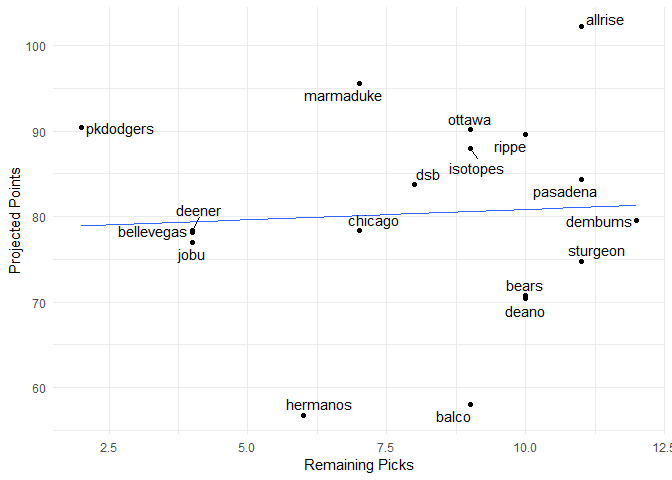

Fantasy 2019
================

#### Today's auction

| Name               |  marginal.total.points|  dollar.value|
|:-------------------|----------------------:|-------------:|
| Mychal Givens      |                   3.38|          9.30|
| Brandon Morrow     |                   3.31|          9.12|
| Shane Greene       |                   2.52|          6.95|
| Isiah Kiner-Falefa |                   1.24|          3.40|
| Ketel Marte        |                   4.43|         12.19|
| John Hicks         |                   3.14|          8.63|
| Troy Tulowitzki    |                   1.04|          2.86|
| Lou Trivino        |                   0.86|          2.38|

#### Draft Status

| position     |  remaining|   max|   avg|
|:-------------|----------:|-----:|-----:|
| catcher      |         17|  11.1|   5.4|
| dh           |          5|  17.1|   8.4|
| first\_base  |          9|  17.0|  11.0|
| outfield     |         44|  17.6|   8.4|
| second\_base |          6|  10.6|   5.6|
| shortstop    |          9|  12.2|   7.4|
| third\_base  |          9|  14.0|   7.2|
| pitcher      |         84|  15.0|   5.0|

| Position |  Still\_to\_be\_Drafted|
|:---------|-----------------------:|
| 1B       |                       3|
| 2B       |                       4|
| 3B       |                       1|
| CI       |                       7|
| DH       |                      13|
| MI       |                       6|
| SS       |                       1|
| C        |                      15|
| OF       |                      26|
| P        |                      60|

#### Current Standings

| team\_name |  spent|  left|  picks.left|  max\_bid|  total\_points|  hit.points|  pitch.points|
|:-----------|------:|-----:|-----------:|---------:|--------------:|-----------:|-------------:|
| allrise    |    229|    31|          11|        21|          102.2|        48.1|          54.1|
| marmaduke  |    247|    13|           7|         7|           95.6|        43.8|          51.8|
| isotopes   |    231|    29|           8|        22|           93.0|        51.0|          42.0|
| rippe      |    227|    33|           9|        25|           92.4|        31.4|          61.0|
| pkdodgers  |    256|     4|           2|         3|           90.4|        35.7|          54.7|
| ottawa     |    222|    38|           9|        30|           90.2|        39.1|          51.1|
| pasadena   |    223|    37|          11|        27|           84.3|        52.2|          32.1|
| dsb        |    242|    18|           8|        11|           83.8|        35.7|          48.1|
| deener     |    255|     5|           3|         3|           81.1|        20.1|          61.0|
| dembums    |    229|    31|          12|        20|           79.5|        36.7|          42.8|
| chicago    |    204|    56|           7|        50|           78.4|        46.2|          32.2|
| bears      |    214|    46|           9|        38|           78.2|        40.0|          38.2|
| bellevegas |    244|    16|           4|        13|           78.1|        40.2|          37.9|
| jobu       |    252|     8|           4|         5|           77.0|        31.9|          45.1|
| sturgeon   |    223|    37|          10|        28|           75.2|        51.0|          24.2|
| deano      |    245|    15|           9|         7|           71.6|        24.0|          47.6|
| hermanos   |    241|    19|           5|        15|           61.6|        36.6|          25.0|
| balco      |    215|    45|           8|        38|           60.0|        27.1|          32.9|

#### Top Remaining Pitchers

| Name               | Team      |   IP|   ERA|  WHIP|    K|   SV|    W|   pts|    dlr|
|:-------------------|:----------|----:|-----:|-----:|----:|----:|----:|-----:|------:|
| Collin McHugh      | Astros    |  151|  4.07|  1.25|  153|    0|   10|  5.44|  14.99|
| Steven Matz        | Mets      |  162|  4.03|  1.29|  153|    0|    9|  4.78|  13.17|
| Danny Duffy        | Royals    |  185|  4.31|  1.33|  164|    0|   10|  4.43|  12.20|
| Mike Minor         | Rangers   |  175|  4.49|  1.30|  160|    0|   10|  4.29|  11.82|
| Marcus Stroman     | Blue Jays |  177|  4.06|  1.36|  138|    0|   11|  4.11|  11.30|
| Dellin Betances    | Yankees   |   75|  2.84|  1.12|  116|    3|    4|  4.05|  11.14|
| Caleb Smith        | Marlins   |  141|  3.99|  1.28|  145|    0|    7|  3.90|  10.74|
| Vince Velasquez    | Phillies  |  150|  4.36|  1.33|  158|    0|    9|  3.89|  10.70|
| Alex Wood          | Reds      |  137|  4.02|  1.29|  123|    0|    9|  3.69|  10.17|
| Jeff Samardzija    | Giants    |  165|  4.34|  1.29|  134|    0|    9|  3.50|   9.65|
| Anthony DeSclafani | Reds      |  153|  4.44|  1.30|  142|    0|    9|  3.49|   9.61|
| Mychal Givens      | Orioles   |   65|  3.89|  1.27|   69|   19|    3|  3.38|   9.30|
| Brandon Morrow     | Cubs      |   55|  3.64|  1.25|   56|   20|    3|  3.31|   9.12|
| Jake Odorizzi      | Twins     |  161|  4.59|  1.34|  151|    0|    9|  3.03|   8.35|
| Trevor Richards    | Marlins   |  132|  4.05|  1.29|  123|    0|    7|  2.92|   8.04|

#### Top Remaining Hitters

| Name             | Team         |   PA|    R|   HR|  RBI|   SB|    AVG|   pts|    dlr|
|:-----------------|:-------------|----:|----:|----:|----:|----:|------:|-----:|------:|
| Kevin Kiermaier  | Rays         |  609|   74|   16|   61|   19|  0.241|  6.40|  17.62|
| Kendrys Morales  | Blue Jays    |  630|   74|   26|   82|    2|  0.250|  6.20|  17.05|
| Justin Smoak     | Blue Jays    |  644|   81|   29|   87|    1|  0.244|  6.16|  16.97|
| Kevin Pillar     | Blue Jays    |  609|   68|   15|   65|   14|  0.258|  5.98|  16.45|
| Brandon Belt     | Giants       |  630|   79|   21|   79|    4|  0.259|  5.85|  16.11|
| Mark Trumbo      | Orioles      |  595|   69|   28|   80|    1|  0.246|  5.65|  15.57|
| Wilmer Flores    | Diamondbacks |  604|   69|   22|   80|    2|  0.275|  5.63|  15.50|
| Josh Bell        | Pirates      |  616|   74|   20|   76|    4|  0.268|  5.61|  15.43|
| Kole Calhoun     | Angels       |  630|   78|   21|   71|    6|  0.241|  5.43|  14.94|
| Hernan Perez     | Brewers      |  545|   58|   15|   60|   16|  0.254|  5.40|  14.86|
| Steven Souza Jr. | Diamondbacks |  560|   66|   21|   67|   11|  0.239|  5.38|  14.82|
| Leonys Martin    | Indians      |  525|   64|   15|   55|   16|  0.249|  5.30|  14.59|
| Evan Longoria    | Giants       |  630|   68|   21|   78|    4|  0.256|  5.07|  13.96|
| Jorge Soler      | Royals       |  581|   68|   23|   70|    4|  0.242|  4.77|  13.13|
| Scott Schebler   | Reds         |  520|   63|   22|   69|    5|  0.244|  4.65|  12.80|

#### Dollars vs. projected points

#### Remaining Picks vs. projected points

#### Best Draft Picks

| team       | player             |  salary|  dollar\_value|  equity|
|:-----------|:-------------------|-------:|--------------:|-------:|
| balco      | Jose Alvarado      |       5|          15.73|   10.73|
| sturgeon   | Brad Peacock       |       5|          15.57|   10.57|
| deener     | Ryan McMahon       |       4|          13.50|    9.50|
| bellevegas | Asdrubal Cabrera   |       5|          14.08|    9.08|
| pkdodgers  | Rich Hill          |      15|          23.02|    8.02|
| marmaduke  | Marco Gonzales     |       8|          15.92|    7.92|
| rippe      | Sonny Gray         |       4|          11.79|    7.79|
| deener     | Marcus Semien      |       9|          16.45|    7.45|
| chicago    | Miguel Sano        |      11|          18.32|    7.32|
| bellevegas | Domingo Santana    |       9|          16.27|    7.27|
| chicago    | Ryan Braun         |      15|          22.26|    7.26|
| bellevegas | Kyle Gibson        |       8|          14.95|    6.95|
| marmaduke  | Miguel Cabrera     |      13|          19.36|    6.36|
| pasadena   | Joe Musgrove       |       8|          14.35|    6.35|
| bellevegas | Jakob Junis        |       9|          15.15|    6.15|
| ottawa     | Jeimer Candelario  |       5|          11.12|    6.12|
| jobu       | Brandon Crawford   |       4|           9.72|    5.72|
| chicago    | Chris Archer       |      20|          25.64|    5.64|
| dsb        | Jackie Bradley Jr. |      15|          20.43|    5.43|
| deener     | Ryan Brasier       |       3|           8.38|    5.38|

#### Unmatched Draft Picks

    ## # A tibble: 14 x 3
    ##    player                team      error      
    ##    <chr>                 <chr>     <chr>      
    ##  1 Luis Robert           allrise   not matched
    ##  2 Royce Lewis           bears     not matched
    ##  3 Brendan McKay         chicago   not matched
    ##  4 Keston Hiura          chicago   not matched
    ##  5 Taylor Trammell       deano     not matched
    ##  6 Forest Whitley        dembums   not matched
    ##  7 Sixto Sanchez         hermanos  not matched
    ##  8 Vladimir Guerrero Jr. ottawa    not matched
    ##  9 Austin Riley          pasadena  not matched
    ## 10 Yusei Kikuchi         rippe     not matched
    ## 11 Nick Senzel           marmaduke not matched
    ## 12 Michael Kopech        deano     not matched
    ## 13 Kyler Murray          bears     not matched
    ## 14 Peter Alonso          sturgeon  not matched
