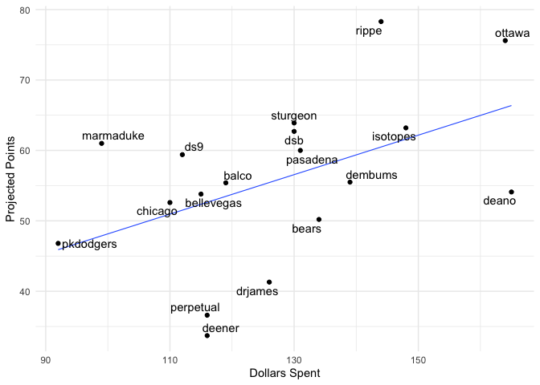
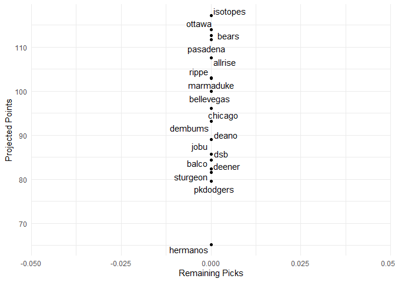

Fantasy 2019
================

\#\#\#\#Today’s auction

\#\#\#\#Draft Status

| position     | remaining |  max |  avg |
| :----------- | --------: | ---: | ---: |
| catcher      |        32 | 21.4 |  7.7 |
| dh           |         5 | 34.9 | 18.4 |
| first\_base  |        19 | 35.3 | 16.4 |
| outfield     |        79 | 38.5 | 14.1 |
| second\_base |        15 | 28.4 | 11.2 |
| shortstop    |        13 | 22.3 | 11.9 |
| third\_base  |        19 | 32.2 | 12.8 |
| pitcher      |       120 | 43.1 |  8.9 |

| Position | Still\_to\_be\_Drafted |
| :------- | ---------------------: |
| 1B       |                     10 |
| 2B       |                      9 |
| 3B       |                      4 |
| CI       |                     14 |
| DH       |                     16 |
| MI       |                     10 |
| SS       |                      3 |
| C        |                     27 |
| OF       |                     58 |
| P        |                    117 |
| Total    |                    268 |

\#\#\#\#Current
Standings

| team\_name | spent | left | picks.left | max\_bid | total\_points | hit.points | pitch.points |
| :--------- | ----: | ---: | ---------: | -------: | ------------: | ---------: | -----------: |
| rippe      |   144 |  116 |         15 |      102 |          78.3 |       31.6 |         46.7 |
| ottawa     |   164 |   96 |         15 |       82 |          75.6 |       30.3 |         45.3 |
| sturgeon   |   130 |  130 |         15 |      116 |          63.9 |       48.0 |         15.9 |
| isotopes   |   148 |  112 |         14 |       99 |          63.2 |       18.7 |         44.5 |
| dsb        |   130 |  130 |         15 |      116 |          62.7 |       20.8 |         41.9 |
| marmaduke  |    99 |  161 |         15 |      147 |          61.0 |       27.5 |         33.5 |
| pasadena   |   131 |  129 |         15 |      115 |          60.0 |       31.9 |         28.1 |
| ds9        |   112 |  148 |         15 |      134 |          59.4 |       15.5 |         43.9 |
| dembums    |   139 |  121 |         15 |      107 |          55.5 |       32.2 |         23.3 |
| balco      |   119 |  141 |         14 |      128 |          55.4 |       34.8 |         20.6 |
| deano      |   165 |   95 |         16 |       80 |          54.1 |       32.4 |         21.7 |
| bellevegas |   115 |  145 |         14 |      132 |          53.8 |       26.7 |         27.1 |
| chicago    |   110 |  150 |         15 |      136 |          52.6 |       15.1 |         37.5 |
| bears      |   134 |  126 |         15 |      112 |          50.2 |       15.0 |         35.2 |
| pkdodgers  |    92 |  168 |         15 |      154 |          46.8 |       15.0 |         31.8 |
| drjames    |   126 |  134 |         15 |      120 |          41.3 |       14.4 |         26.9 |
| perpetual  |   116 |  144 |         15 |      130 |          36.6 |       12.6 |         24.0 |
| deener     |   116 |  144 |         15 |      130 |          33.7 |       10.9 |         22.8 |

\#\#\#\#Top Remaining
Pitchers

| Name            | Team      |  IP |  ERA | WHIP |   K | SV |  W |   pts |   dlr |
| :-------------- | :-------- | --: | ---: | ---: | --: | -: | -: | ----: | ----: |
| Max Scherzer    | Nationals | 205 | 3.28 | 1.04 | 272 |  0 | 15 | 15.66 | 43.10 |
| Chris Sale      | Red Sox   | 177 | 3.19 | 1.03 | 233 |  0 | 14 | 13.65 | 37.59 |
| Clayton Kershaw | Dodgers   | 204 | 3.55 | 1.16 | 209 |  0 | 14 | 10.93 | 30.10 |
| Aaron Nola      | Phillies  | 211 | 3.83 | 1.24 | 235 |  0 | 13 |  9.44 | 25.99 |
| Yu Darvish      | Cubs      | 185 | 3.86 | 1.19 | 221 |  0 | 12 |  9.10 | 25.05 |
| Aroldis Chapman | Yankees   |  65 | 3.01 | 1.12 |  94 | 34 |  4 |  8.90 | 24.51 |
| Edwin Diaz      | Mets      |  65 | 2.90 | 1.05 |  98 | 31 |  4 |  8.87 | 24.42 |
| Liam Hendriks   | Athletics |  70 | 3.17 | 1.08 |  92 | 30 |  4 |  8.29 | 22.82 |
| Craig Kimbrel   | Cubs      |  65 | 3.57 | 1.19 |  90 | 35 |  4 |  8.18 | 22.53 |
| Kenley Jansen   | Dodgers   |  65 | 3.87 | 1.14 |  75 | 37 |  3 |  7.82 | 21.53 |
| Andrew Heaney   | Angels    | 168 | 4.01 | 1.18 | 183 |  0 | 12 |  7.61 | 20.95 |
| Zack Wheeler    | Phillies  | 189 | 4.13 | 1.23 | 195 |  0 | 12 |  7.20 | 19.81 |
| Ken Giles       | Blue Jays |  65 | 3.56 | 1.16 |  82 | 30 |  4 |  7.14 | 19.65 |
| Zack Greinke    | Astros    | 202 | 4.26 | 1.24 | 182 |  0 | 14 |  7.10 | 19.55 |
| Raisel Iglesias | Reds      |  65 | 3.87 | 1.21 |  78 | 31 |  3 |  6.39 | 17.58 |

\#\#\#\#Top Remaining
Hitters

| Name              | Team      |  PA |   R | HR | RBI | SB |   AVG |   pts |   dlr |
| :---------------- | :-------- | --: | --: | -: | --: | -: | ----: | ----: | ----: |
| Giancarlo Stanton | Yankees   | 616 | 101 | 49 | 115 |  3 | 0.268 | 13.99 | 38.52 |
| Bryce Harper      | Phillies  | 665 | 103 | 41 | 103 | 11 | 0.259 | 13.29 | 36.60 |
| Freddie Freeman   | Braves    | 672 |  99 | 34 | 105 |  6 | 0.293 | 12.82 | 35.29 |
| Nelson Cruz       | Twins     | 637 |  95 | 40 | 112 |  1 | 0.282 | 12.67 | 34.88 |
| Starling Marte    | Pirates   | 630 |  82 | 21 |  78 | 26 | 0.287 | 12.43 | 34.23 |
| Anthony Rizzo     | Cubs      | 672 |  98 | 32 | 101 |  6 | 0.284 | 11.77 | 32.42 |
| Manny Machado     | Padres    | 679 |  96 | 38 | 100 |  7 | 0.271 | 11.71 | 32.23 |
| Marcell Ozuna     | NA        | 644 |  84 | 33 | 103 |  7 | 0.276 | 11.44 | 31.50 |
| Peter Alonso      | Mets      | 665 |  99 | 44 | 105 |  2 | 0.252 | 11.22 | 30.88 |
| Kris Bryant       | Cubs      | 658 |  99 | 31 |  90 |  4 | 0.273 | 10.48 | 28.84 |
| Paul Goldschmidt  | Cardinals | 679 |  93 | 32 |  94 |  5 | 0.273 | 10.36 | 28.53 |
| Jose Altuve       | Astros    | 658 |  97 | 24 |  90 | 12 | 0.295 | 10.32 | 28.42 |
| Jose Abreu        | White Sox | 644 |  85 | 31 |  99 |  3 | 0.275 |  9.84 | 27.09 |
| Khris Davis       | Athletics | 637 |  86 | 39 | 104 |  1 | 0.243 |  9.50 | 26.16 |
| Josh Donaldson    | NA        | 644 |  98 | 35 |  87 |  4 | 0.257 |  9.36 | 25.76 |
| \#\#\#\#Top OF    |           |     |     |    |     |    |       |       |       |

| Name                 | Team      |  PA |   R | HR | RBI | SB |   AVG |   pts |   dlr |
| :------------------- | :-------- | --: | --: | -: | --: | -: | ----: | ----: | ----: |
| Giancarlo Stanton    | Yankees   | 616 | 101 | 49 | 115 |  3 | 0.268 | 13.99 | 38.52 |
| Bryce Harper         | Phillies  | 665 | 103 | 41 | 103 | 11 | 0.259 | 13.29 | 36.60 |
| Starling Marte       | Pirates   | 630 |  82 | 21 |  78 | 26 | 0.287 | 12.43 | 34.23 |
| Marcell Ozuna        | NA        | 644 |  84 | 33 | 103 |  7 | 0.276 | 11.44 | 31.50 |
| Kris Bryant          | Cubs      | 658 |  99 | 31 |  90 |  4 | 0.273 | 10.48 | 28.84 |
| Khris Davis          | Athletics | 637 |  86 | 39 | 104 |  1 | 0.243 |  9.50 | 26.16 |
| Yasiel Puig          | NA        | 560 |  70 | 25 |  81 | 14 | 0.268 |  9.30 | 25.61 |
| Michael Brantley     | Astros    | 609 |  83 | 20 |  85 |  5 | 0.289 |  8.95 | 24.63 |
| Nicholas Castellanos | NA        | 644 |  86 | 26 |  87 |  3 | 0.275 |  8.90 | 24.51 |
| Lorenzo Cain         | Brewers   | 630 |  81 | 15 |  62 | 19 | 0.277 |  8.83 | 24.32 |
| David Dahl           | Rockies   | 581 |  75 | 23 |  79 |  9 | 0.275 |  8.62 | 23.74 |
| Ryan Braun           | Brewers   | 539 |  70 | 25 |  81 |  9 | 0.268 |  8.38 | 23.07 |
| Michael Conforto     | Mets      | 602 |  82 | 31 |  85 |  5 | 0.251 |  8.34 | 22.97 |
| Adam Eaton           | Nationals | 630 |  86 | 15 |  63 | 12 | 0.282 |  8.12 | 22.34 |
| Justin Upton         | Angels    | 623 |  81 | 30 |  91 |  5 | 0.240 |  7.87 | 21.65 |

<!-- -->

\#\#\#\#Remaining Picks vs. projected points
<!-- -->

\#\#\#\#Best Draft Picks

| team       | player                | salary | dollar\_value | equity |
| :--------- | :-------------------- | -----: | ------------: | -----: |
| sturgeon   | Ronald Acuna Jr.      |      9 |         45.68 |  36.68 |
| ds9        | Luis Robert           |      0 |         35.09 |  35.09 |
| pkdodgers  | Cody Bellinger        |     12 |         44.24 |  32.24 |
| rippe      | Juan Soto             |      9 |         39.44 |  30.44 |
| dembums    | Yordan Alvarez        |      5 |         34.43 |  29.43 |
| marmaduke  | Adalberto Mondesi     |      9 |         36.73 |  27.73 |
| pasadena   | Victor Robles         |      5 |         29.67 |  24.67 |
| rippe      | Rafael Devers         |     12 |         35.53 |  23.53 |
| rippe      | Trevor Story          |     17 |         39.89 |  22.89 |
| ottawa     | Jose Ramirez          |     17 |         39.50 |  22.50 |
| bellevegas | Gleyber Torres        |      9 |         31.29 |  22.29 |
| bears      | Vladimir Guerrero Jr. |      5 |         26.87 |  21.87 |
| bellevegas | Eloy Jimenez          |      7 |         28.30 |  21.30 |
| isotopes   | Trea Turner           |     19 |         40.22 |  21.22 |
| sturgeon   | Bo Bichette           |      7 |         28.12 |  21.12 |
| chicago    | Keston Hiura          |      5 |         26.04 |  21.04 |
| rippe      | Aaron Judge           |     12 |         32.58 |  20.58 |
| ottawa     | Fernando Tatis Jr.    |     12 |         31.82 |  19.82 |
| rippe      | Jack Flaherty         |     11 |         29.64 |  18.64 |
| sturgeon   | Jeff McNeil           |      6 |         24.57 |  18.57 |

\#\#\#\#Unmatched Draft Picks

| player            | team      | error       |
| :---------------- | :-------- | :---------- |
| Nick Madrigal     | bears     | not matched |
| Alec Bohm         | bears     | not matched |
| Adley Rutschman   | bears     | not matched |
| Royce Lewis       | bears     | not matched |
| Jarred Kelenic    | chicago   | not matched |
| Joey Bart         | deener    | not matched |
| Seth Beer         | deener    | not matched |
| Jonathan India    | deener    | not matched |
| Kristian Robinson | ds9       | not matched |
| Matt Manning      | dembums   | not matched |
| Vidal Brujan      | deano     | not matched |
| Triston Casas     | deano     | not matched |
| Nolan Gorman      | drjames   | not matched |
| Luis Patino       | isotopes  | not matched |
| Marco Luciano     | ottawa    | not matched |
| Casey Mize        | pasadena  | not matched |
| Nate Lowe         | perpetual | not matched |
| Ian Anderson      | perpetual | not matched |
| Nate Pearson      | perpetual | not matched |
| Gio Urshela       | pkdodgers | not matched |
| Keibert Ruiz      | pkdodgers | not matched |
| Wander Franco     | rippe     | not matched |
| Lance McCullers   | rippe     | not matched |
| Pete Alonso       | sturgeon  | not matched |
| Xavier Edwards    | sturgeon  | not matched |
| Andrew Vaughn     | marmaduke | not matched |
