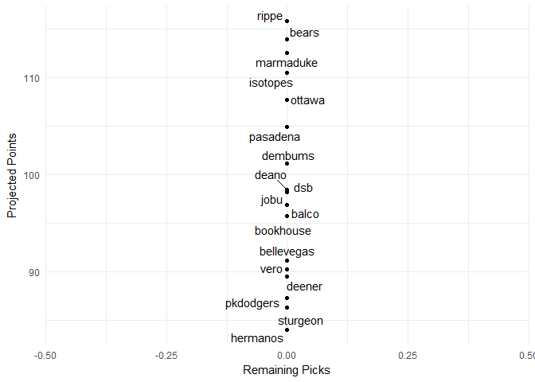
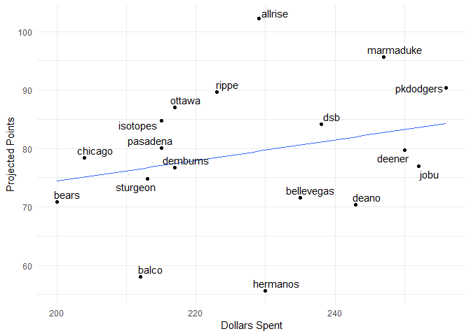

Fantasy 2018
================

#### Current Standings

    ##     team_name spent left picks.left total_points hit.points pitch.points
    ## 1       rippe   251    9          6        109.4       70.6         38.8
    ## 2       bears   246   14          5        106.0       70.6         35.4
    ## 3      ottawa   254    6          1        105.9       61.1         44.8
    ## 4   marmaduke   248   12          7        102.5       65.7         36.8
    ## 5    pasadena   239   21          8        102.3       71.9         30.4
    ## 6    isotopes   243   17          5        101.8       62.1         39.7
    ## 7        jobu   260    0          0         99.6       47.0         52.6
    ## 8   bookhouse   255    5          1         99.0       52.6         46.4
    ## 9         dsb   262   -2          9         98.6       61.8         36.8
    ## 10 bellevegas   255    5          3         94.1       54.9         39.2
    ## 11    dembums   235   25         10         91.2       56.5         34.7
    ## 12      deano   251    9          9         86.7       46.1         40.6
    ## 13  pkdodgers   241   19          1         83.1       43.3         39.8
    ## 14      balco   234   26          3         82.3       48.2         34.1
    ## 15       vero   233   27          6         81.0       40.8         40.2
    ## 16   sturgeon   210   50          8         80.9       38.7         42.2
    ## 17   hermanos   248   12          7         79.5       44.6         34.9
    ## 18     deener   225   35          2         78.4       45.1         33.3

#### Top Remaining Pitchers

    ##                name         Team  IP  ERA WHIP   K SV  W  pts  dlr
    ## 1      Brad Ziegler      Marlins  65 4.27 1.48  41 29  3 3.03 8.34
    ## 2      Tyler Skaggs       Angels 154 4.27 1.34 140  0 10 2.30 6.33
    ## 3    Brad Boxberger Diamondbacks  65 4.12 1.37  74 18  3 2.29 6.32
    ## 4       Dan Straily      Marlins 182 4.59 1.32 164  0  9 2.27 6.26
    ## 5     Marco Estrada    Blue Jays 183 4.76 1.34 160  0 11 2.26 6.22
    ## 6   Clayton Richard       Padres 191 3.94 1.39 142  0 10 2.22 6.10
    ## 7      Nick Pivetta     Phillies 157 4.56 1.34 159  0  9 2.09 5.74
    ## 8       Juan Minaya    White Sox  65 4.69 1.42  64 20  3 1.96 5.39
    ## 9      Jaime Garcia         <NA> 168 4.29 1.37 137  0 10 1.90 5.22
    ## 10      Ryan Madson    Nationals  65 3.32 1.21  68  9  4 1.86 5.12
    ## 11   Tyler Anderson      Rockies 144 4.35 1.35 132  0  9 1.71 4.70
    ## 12      John Lackey         <NA> 172 4.80 1.34 144  0 10 1.66 4.57
    ## 13 Mike Foltynewicz       Braves 150 4.46 1.36 140  0  9 1.65 4.54
    ## 14   German Marquez      Rockies 140 4.46 1.35 131  0  9 1.58 4.35
    ## 15      Jakob Junis       Royals 162 4.61 1.30 133  0  8 1.57 4.32
    ## 16   Jerad Eickhoff     Phillies 159 4.62 1.32 141  0  8 1.55 4.26
    ## 17 Santiago Casilla    Athletics  65 4.52 1.36  59 16  3 1.46 4.03
    ## 18  Mike Montgomery         Cubs 156 4.26 1.41 128  0 10 1.42 3.90
    ## 19    Jharel Cotton    Athletics 161 4.77 1.36 147  0  9 1.37 3.77
    ## 20   Chris Stratton       Giants 154 4.21 1.39 124  0  9 1.32 3.63

#### Top Remaining Hitters

    ##                name         Team  PA  R HR RBI SB   AVG  pts   dlr
    ## 1       Neil Walker         <NA> 595 73 23  79  3 0.266 5.05 13.91
    ## 2      Raimel Tapia      Rockies 490 56  8  53 16 0.292 4.79 13.20
    ## 3    Dustin Pedroia      Red Sox 595 71 10  63  6 0.291 4.79 13.19
    ## 4     Yasmany Tomas Diamondbacks 525 63 23  76  3 0.262 4.36 12.02
    ## 5     Mikie Mahtook       Tigers 630 73 17  70  8 0.256 4.30 11.84
    ## 6  Cheslor Cuthbert       Royals 616 68 18  70  3 0.261 4.28 11.79
    ## 7     Jose Iglesias       Tigers 595 62  7  57 11 0.274 3.96 10.90
    ## 8         Joe Panik       Giants 581 71 10  57  4 0.281 3.88 10.68
    ## 9      Jason Castro        Twins 576 66 16  64  2 0.234 3.74 10.30
    ## 10      Jose Pirela       Padres 560 58 15  64  9 0.263 3.61  9.93
    ## 11      Jorge Soler       Royals 595 70 24  76  2 0.243 3.60  9.91
    ## 12     Devon Travis    Blue Jays 455 59 12  51  7 0.280 3.52  9.68
    ## 13   Mitch Moreland      Red Sox 595 72 23  78  1 0.253 3.46  9.53
    ## 14 Asdrubal Cabrera         Mets 560 64 16  62  4 0.260 3.46  9.51
    ## 15    J.P. Crawford     Phillies 616 66 14  66  9 0.242 3.42  9.41
    ## 16     Martin Prado      Marlins 560 58 10  56  2 0.274 3.19  8.78
    ## 17      Brad Miller         Rays 560 65 19  66  7 0.239 3.18  8.76
    ## 18 Brandon Phillips         <NA> 490 53 11  52 10 0.274 3.17  8.73
    ## 19  Victor Martinez       Tigers 595 67 19  75  1 0.271 3.10  8.54
    ## 20      Alex Gordon       Royals 630 68 17  66  8 0.238 3.03  8.35

#### Top Remaining C

    ##                  name         Team  PA  R HR RBI SB   AVG   pts   dlr
    ## 1        Jason Castro        Twins 576 66 16  64  2 0.234  3.74 10.30
    ## 2      Russell Martin    Blue Jays 448 54 16  54  3 0.232  2.79  7.68
    ## 3  Francisco Cervelli      Pirates 384 38  5  36  3 0.263  1.93  5.32
    ## 4       Bruce Maxwell    Athletics 416 43  9  42  1 0.246  1.65  4.53
    ## 5        Stephen Vogt      Brewers 288 33 11  37  1 0.257  1.64  4.52
    ## 6      Chris Iannetta      Rockies 320 39 11  39  1 0.246  1.52  4.19
    ## 7     Tucker Barnhart         Reds 352 34  6  35  2 0.257  1.41  3.88
    ## 8          Manny Pina      Brewers 288 30  7  32  2 0.254  0.96  2.64
    ## 9         Kurt Suzuki       Braves 286 29  7  32  1 0.256  0.89  2.45
    ## 10   Martin Maldonado       Angels 384 41 11  40  2 0.221  0.54  1.50
    ## 11       Caleb Joseph      Orioles 320 33 10  35  2 0.234  0.38  1.04
    ## 12    Steve Clevenger         <NA> 256 24  4  25  2 0.256  0.33  0.90
    ## 13         John Hicks       Tigers 233 24  7  26  3 0.249  0.31  0.85
    ## 14      Roberto Perez      Indians 320 36  9  35  2 0.226  0.18  0.49
    ## 15         Alex Avila Diamondbacks 331 38 10  36  1 0.225  0.16  0.43
    ## 16       Cameron Rupp     Phillies 320 34 12  38  1 0.222  0.12  0.32
    ## 17     Devin Mesoraco         Reds 256 28 10  31  2 0.233  0.06  0.16
    ## 18          Yan Gomes      Indians 256 29  9  32  1 0.236  0.04  0.11
    ## 19         Elias Diaz      Pirates 192 17  3  19  2 0.258 -0.31 -0.85
    ## 20     Dioner Navarro         <NA> 256 25  7  28  2 0.235 -0.33 -0.92

#### Top Remaining OF

    ##                 name         Team  PA  R HR RBI SB   AVG  pts   dlr
    ## 1       Raimel Tapia      Rockies 490 56  8  53 16 0.292 4.79 13.20
    ## 2      Yasmany Tomas Diamondbacks 525 63 23  76  3 0.262 4.36 12.02
    ## 3      Mikie Mahtook       Tigers 630 73 17  70  8 0.256 4.30 11.84
    ## 4        Jose Pirela       Padres 560 58 15  64  9 0.263 3.61  9.93
    ## 5        Jorge Soler       Royals 595 70 24  76  2 0.243 3.60  9.91
    ## 6        Alex Gordon       Royals 630 68 17  66  8 0.238 3.03  8.35
    ## 7      Jose Martinez    Cardinals 368 45 11  48  4 0.286 2.61  7.18
    ## 8       Steve Pearce    Blue Jays 455 56 18  61  2 0.257 2.52  6.95
    ## 9      Melky Cabrera         <NA> 420 47 10  50  1 0.286 2.41  6.63
    ## 10        Adam Engel    White Sox 595 63 13  54 24 0.209 2.31  6.35
    ## 11        Seth Smith         <NA> 490 62 16  55  2 0.253 2.25  6.20
    ## 12     Paulo Orlando       Royals 525 51  8  49 10 0.261 2.16  5.95
    ## 13     Brandon Drury Diamondbacks 435 47 13  54  2 0.267 1.93  5.32
    ## 14     Leonys Martin       Tigers 420 46 10  42 18 0.246 1.91  5.27
    ## 15      Adam Frazier      Pirates 354 43  4  30  9 0.285 1.78  4.89
    ## 16     Gerardo Parra      Rockies 371 41  9  43  5 0.276 1.67  4.61
    ## 17 Curtis Granderson    Blue Jays 441 58 18  56  4 0.234 1.61  4.43
    ## 18     Hunter Dozier       Royals 595 60 16  63  5 0.227 1.51  4.16
    ## 19     Matt Holliday         <NA> 420 49 16  54  1 0.246 1.15  3.17
    ## 20    Austin Jackson       Giants 420 43  6  42  6 0.266 1.15  3.15

#### Dollars vs. projected points

    ## # A tibble: 18 x 4
    ##       rowname total_points     value       delta
    ##         <chr>        <dbl>     <dbl>       <dbl>
    ##  1      rippe        109.4  96.91557  12.4844280
    ##  2      bears        106.0  94.48665  11.5133458
    ##  3   pasadena        102.3  91.08617  11.2138308
    ##  4   isotopes        101.8  93.02930   8.7706965
    ##  5     ottawa        105.9  98.37292   7.5270773
    ##  6  marmaduke        102.5  95.45822   7.0417787
    ##  7   sturgeon         80.9  76.99845   3.9015541
    ##  8    dembums         91.2  89.14303   2.0569650
    ##  9  bookhouse         99.0  98.85871   0.1412937
    ## 10       jobu         99.6 101.28762  -1.6876241
    ## 11        dsb         98.6 102.25919  -3.6591912
    ## 12 bellevegas         94.1  98.85871  -4.7587063
    ## 13     deener         78.4  84.28520  -5.8851993
    ## 14      balco         82.3  88.65725  -6.3572514
    ## 15       vero         81.0  88.17147  -7.1714678
    ## 16  pkdodgers         83.1  92.05774  -8.9577364
    ## 17      deano         86.7  96.91557 -10.2155720
    ## 18   hermanos         79.5  95.45822 -15.9582213

#### Remaining Picks vs. projected points

#### Data entry errors

    ##                   player      team       error
    ## 1        Brendan Rodgers     rippe not matched
    ## 2            Nick Senzel  sturgeon not matched
    ## 3            Alec Hansen pkdodgers not matched
    ## 4  Vladimir Guerrero Jr.    ottawa not matched
    ## 5           Kolby Allard      jobu not matched
    ## 6           Kevin Maitan     deano not matched
    ## 7                 AJ Puk    ottawa not matched
    ## 8          Scott Kingery  sturgeon not matched
    ## 9           Mitch Keller pkdodgers not matched
    ## 10    Fernando Tatis Jr.    ottawa not matched
    ## 11      Yoshihisa Hirano  hermanos not matched
