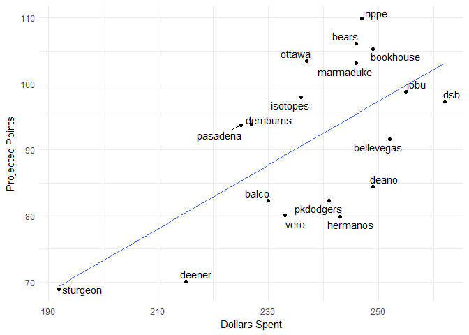

#### Current Standings

    ##     team_name spent left picks.left total_points hit.points pitch.points
    ## 1       rippe   242   18          8        107.4       72.7         34.7
    ## 2       bears   212   48          9         99.5       69.4         30.1
    ## 3   marmaduke   232   28         10         94.7       59.2         35.5
    ## 4         dsb   249   11         11         94.1       59.2         34.9
    ## 5     dembums   220   40         13         92.6       61.8         30.8
    ## 6    isotopes   220   40          8         91.6       53.2         38.4
    ## 7        jobu   240   20          4         91.6       38.8         52.8
    ## 8  bellevegas   246   14          5         89.5       49.7         39.8
    ## 9   bookhouse   205   55         10         87.6       48.0         39.6
    ## 10     ottawa   201   59          8         86.1       49.7         36.4
    ## 11      deano   240   20         12         84.1       44.8         39.3
    ## 12   pasadena   196   64         12         83.8       56.6         27.2
    ## 13  pkdodgers   236   24          3         81.0       42.4         38.6
    ## 14      balco   216   44          7         78.5       48.9         29.6
    ## 15   hermanos   230   30         10         75.6       39.1         36.5
    ## 16   sturgeon   176   84         13         70.8       39.4         31.4
    ## 17       vero   239   21          6         70.1       33.4         36.7
    ## 18     deener   170   90         10         55.5       35.0         20.5

#### Top Remaining Pitchers

    ##                name         Team  IP  ERA WHIP   K SV  W  pts   dlr
    ## 1    Jeurys Familia         Mets  65 3.59 1.34  65 32  3 3.80 10.45
    ## 2    Brad Boxberger Diamondbacks  65 4.10 1.34  74 27  3 2.86  7.87
    ## 3      Shane Greene       Tigers  65 3.94 1.31  64 27  3 2.84  7.82
    ## 4      Alex Claudio      Rangers  65 3.97 1.38  48 27  3 2.22  6.11
    ## 5       Juan Minaya    White Sox  65 4.79 1.44  62 27  3 1.88  5.17
    ## 6         J.A. Happ    Blue Jays 171 4.11 1.29 154  0 11 1.80  4.95
    ## 7      Brad Ziegler      Marlins  65 3.99 1.47  43 27  3 1.76  4.85
    ## 8       Sean Manaea    Athletics 173 4.16 1.33 149  0 11 1.21  3.34
    ## 9       Danny Duffy       Royals 180 4.32 1.31 156  0 10 1.05  2.88
    ## 10     Tyler Skaggs       Angels 154 4.13 1.31 138  0 10 1.04  2.87
    ## 11      Luiz Gohara       Braves 130 3.72 1.32 141  0  8 1.01  2.79
    ## 12 Santiago Casilla    Athletics  65 4.33 1.37  60 19  3 0.93  2.56
    ## 13      Ryan Madson    Nationals  65 3.26 1.18  70  9  4 0.91  2.50
    ## 14    Blake Treinen    Athletics  65 3.65 1.35  63 16  3 0.88  2.43
    ## 15  Felix Hernandez     Mariners 162 4.24 1.32 141  0 10 0.84  2.31
    ## 16   Taijuan Walker Diamondbacks 189 4.51 1.35 170  0 11 0.84  2.31
    ## 17      Brett Cecil    Cardinals  65 3.50 1.23  66 12  3 0.78  2.14
    ## 18   Mike Clevinger      Indians 169 4.46 1.38 168  0 11 0.76  2.08
    ## 19    Julio Teheran       Braves 179 4.40 1.32 152  0 10 0.75  2.08
    ## 20    Marco Estrada    Blue Jays 183 4.70 1.33 165  0 11 0.74  2.03

#### Top Remaining Hitters

    ##                 name         Team  PA  R HR RBI SB   AVG  pts   dlr
    ## 1      Jorge Polanco        Twins 644 75 16  74 14 0.274 6.29 17.30
    ## 2   Michael Brantley      Indians 504 65 15  68 10 0.292 5.73 15.79
    ## 3      Wilmer Flores         Mets 560 67 25  78  3 0.273 5.70 15.69
    ## 4      Dexter Fowler    Cardinals 623 85 17  71 11 0.262 5.59 15.38
    ## 5      Maikel Franco     Phillies 574 68 27  83  1 0.265 5.51 15.17
    ## 6       Josh Reddick       Astros 560 69 17  72  6 0.282 5.33 14.66
    ## 7     Dustin Pedroia      Red Sox 595 70 12  67  6 0.293 5.27 14.50
    ## 8        Mark Trumbo      Orioles 581 74 31  87  1 0.253 5.25 14.45
    ## 9        Neil Walker         <NA> 595 74 22  77  3 0.270 5.16 14.20
    ## 10     Marcus Semien    Athletics 595 74 21  68 13 0.252 5.11 14.07
    ## 11      Raimel Tapia      Rockies 490 54  8  55 16 0.296 5.02 13.83
    ## 12      Kole Calhoun       Angels 644 79 21  79  4 0.259 5.00 13.76
    ## 13       Austin Hays      Orioles 525 65 19  68  7 0.277 4.96 13.64
    ## 14       Ian Kinsler       Angels 595 80 18  62 11 0.260 4.86 13.37
    ## 15       Kolten Wong    Cardinals 588 68 13  68 11 0.272 4.83 13.30
    ## 16     Josh Harrison      Pirates 560 65 11  53 12 0.277 4.71 12.98
    ## 17     Yasmany Tomas Diamondbacks 525 63 24  78  4 0.265 4.68 12.89
    ## 18      Raul Mondesi       Royals 574 60 14  59 30 0.239 4.66 12.84
    ## 19  Cheslor Cuthbert       Royals 651 70 18  72  3 0.262 4.51 12.43
    ## 20 Robinson Chirinos      Rangers 515 64 22  66  4 0.232 4.35 11.98

#### Top Remaining MI

    ##                name         Team  PA  R HR RBI SB   AVG  pts   dlr
    ## 1     Jorge Polanco        Twins 644 75 16  74 14 0.274 6.29 17.30
    ## 2    Dustin Pedroia      Red Sox 595 70 12  67  6 0.293 5.27 14.50
    ## 3       Neil Walker         <NA> 595 74 22  77  3 0.270 5.16 14.20
    ## 4     Marcus Semien    Athletics 595 74 21  68 13 0.252 5.11 14.07
    ## 5       Ian Kinsler       Angels 595 80 18  62 11 0.260 4.86 13.37
    ## 6       Kolten Wong    Cardinals 588 68 13  68 11 0.272 4.83 13.30
    ## 7      Raul Mondesi       Royals 574 60 14  59 30 0.239 4.66 12.84
    ## 8     Jose Iglesias       Tigers 595 63  8  58 12 0.274 4.12 11.35
    ## 9      Jason Kipnis      Indians 560 73 15  60 10 0.259 4.07 11.20
    ## 10 Asdrubal Cabrera         Mets 595 66 18  67  4 0.262 3.99 10.99
    ## 11        Joe Panik       Giants 581 70 11  58  4 0.281 3.90 10.72
    ## 12     Devon Travis    Blue Jays 455 61 12  51  7 0.282 3.65 10.06
    ## 13  Troy Tulowitzki    Blue Jays 546 62 20  68  2 0.259 3.57  9.84
    ## 14 Brandon Phillips         <NA> 490 52 10  51 10 0.280 3.37  9.27
    ## 15     Chris Owings Diamondbacks 485 51 10  53 13 0.263 3.17  8.73
    ## 16      Brad Miller         Rays 560 65 20  66  7 0.238 3.15  8.66
    ## 17     Jordy Mercer      Pirates 595 59 13  62  3 0.262 2.97  8.17
    ## 18    Dixon Machado       Tigers 574 60  7  52 10 0.263 2.94  8.08
    ## 19  Alcides Escobar         <NA> 630 58  7  59 12 0.251 2.73  7.51
    ## 20       Jed Lowrie    Athletics 595 63 11  65  1 0.264 2.71  7.45

#### Top Remaining C

    ##                  name      Team  PA  R HR RBI SB   AVG  pts   dlr
    ## 1   Robinson Chirinos   Rangers 515 64 22  66  4 0.232 4.35 11.98
    ## 2   Christian Vazquez   Red Sox 448 53  8  50  6 0.273 4.30 11.85
    ## 3        Wilson Ramos      Rays 480 53 20  62  1 0.253 4.24 11.67
    ## 4        Jason Castro     Twins 576 66 15  63  2 0.231 3.44  9.47
    ## 5        James McCann    Tigers 480 50 13  53  3 0.248 3.06  8.43
    ## 6      Russell Martin Blue Jays 448 54 17  55  3 0.231 2.82  7.75
    ## 7     Travis d'Arnaud      Mets 384 40 14  47  1 0.253 2.52  6.94
    ## 8        Matt Wieters Nationals 448 45 13  51  2 0.245 2.47  6.81
    ## 9       Austin Hedges    Padres 448 42 17  53  4 0.230 2.33  6.42
    ## 10     Chris Iannetta   Rockies 320 39 13  41  1 0.255 2.24  6.17
    ## 11 Francisco Cervelli   Pirates 384 37  6  37  3 0.266 2.10  5.79
    ## 12      Bruce Maxwell Athletics 416 43  8  41  2 0.249 1.75  4.82
    ## 13    Tucker Barnhart      Reds 352 33  7  35  2 0.255 1.30  3.59
    ## 14       Stephen Vogt   Brewers 256 29 10  33  1 0.257 1.29  3.54
    ## 15        Kurt Suzuki    Braves 286 28  8  34  1 0.255 1.05  2.89
    ## 16   Martin Maldonado    Angels 384 41 11  40  2 0.225 0.73  2.01
    ## 17       Caleb Joseph   Orioles 320 34  9  35  2 0.238 0.71  1.96
    ## 18      Roberto Perez   Indians 320 37  9  35  3 0.228 0.41  1.14
    ## 19         John Hicks    Tigers 233 23  6  26  3 0.250 0.32  0.87
    ## 20    Steve Clevenger      <NA> 256 24  4  25  2 0.256 0.31  0.84

#### Top Remaining OF

    ##                name         Team  PA  R HR RBI SB   AVG  pts   dlr
    ## 1  Michael Brantley      Indians 504 65 15  68 10 0.292 5.73 15.79
    ## 2     Dexter Fowler    Cardinals 623 85 17  71 11 0.262 5.59 15.38
    ## 3      Josh Reddick       Astros 560 69 17  72  6 0.282 5.33 14.66
    ## 4       Mark Trumbo      Orioles 581 74 31  87  1 0.253 5.25 14.45
    ## 5      Raimel Tapia      Rockies 490 54  8  55 16 0.296 5.02 13.83
    ## 6      Kole Calhoun       Angels 644 79 21  79  4 0.259 5.00 13.76
    ## 7       Austin Hays      Orioles 525 65 19  68  7 0.277 4.96 13.64
    ## 8     Yasmany Tomas Diamondbacks 525 63 24  78  4 0.265 4.68 12.89
    ## 9     Mikie Mahtook       Tigers 630 69 16  72  8 0.259 4.26 11.74
    ## 10     Hunter Pence       Giants 595 64 19  74  4 0.264 4.13 11.37
    ## 11     Brandon Moss       Royals 595 70 30  82  3 0.231 3.89 10.70
    ## 12     Steve Pearce    Blue Jays 539 67 22  73  2 0.257 3.86 10.63
    ## 13    Jason Heyward         Cubs 560 61 14  63  9 0.266 3.85 10.61
    ## 14      Jose Pirela       Padres 560 61 16  60 10 0.263 3.81 10.50
    ## 15   Nick Delmonico    White Sox 539 62 19  67  4 0.249 3.06  8.41
    ## 16 Stephen Piscotty    Athletics 532 62 16  62  6 0.254 3.05  8.39
    ## 17      Jorge Soler       Royals 574 65 24  70  2 0.241 3.03  8.34
    ## 18      Alex Gordon       Royals 616 65 18  64  8 0.238 2.85  7.83
    ## 19   Randal Grichuk    Blue Jays 455 57 23  66  5 0.243 2.83  7.80
    ## 20  Carlos Gonzalez         <NA> 455 54 18  62  2 0.257 2.54  6.99

#### Dollars vs. projected points

\#\#\#\#Dollars vs. Remaining Picks

#### Data entry errors

    ##                   player      team       error
    ## 1        Brendan Rodgers     rippe not matched
    ## 2            Nick Senzel  sturgeon not matched
    ## 3            Alec Hansen pkdodgers not matched
    ## 4         Michael Kopech pkdodgers not matched
    ## 5  Vladimir Guerrero Jr.    ottawa not matched
    ## 6           Kolby Allard      jobu not matched
    ## 7           Kevin Maitan     deano not matched
    ## 8              John Jaso  isotopes not matched
    ## 9          Albert Almora      vero not matched
    ## 10       Randall Grichuk    ottawa not matched
    ## 11       Nicky Delmonico      vero not matched
