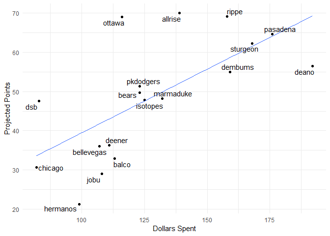

Fantasy 2018
================

#### Current Standings

    ##     team_name spent left picks.left total_points hit.points pitch.points
    ## 1   marmaduke   257    3          3        113.9       74.3         39.6
    ## 2    isotopes   253    7          0        113.4       67.7         45.7
    ## 3       rippe   253    7          5        112.7       73.9         38.8
    ## 4       bears   252    8          3        109.1       70.6         38.5
    ## 5    pasadena   253    7          4        108.1       71.9         36.2
    ## 6      ottawa   254    6          1        105.9       61.1         44.8
    ## 7        jobu   260    0          0         99.6       47.0         52.6
    ## 8   bookhouse   255    5          1         99.0       52.6         46.4
    ## 9         dsb   265   -5          6         97.6       61.8         35.8
    ## 10    dembums   246   14          5         96.6       58.7         37.9
    ## 11 bellevegas   256    4          2         94.7       55.5         39.2
    ## 12      deano   252    8          8         88.0       47.4         40.6
    ## 13   sturgeon   241   19          1         86.1       38.8         47.3
    ## 14      balco   240   20          1         84.4       48.8         35.6
    ## 15  pkdodgers   241   19          1         83.1       43.3         39.8
    ## 16       vero   234   26          5         82.3       40.8         41.5
    ## 17   hermanos   249   11          6         80.8       45.9         34.9
    ## 18     deener   230   30          1         79.4       46.1         33.3

#### Top Remaining Pitchers

    ##                name      Team  IP  ERA WHIP   K SV  W  pts  dlr
    ## 1       Dan Straily   Marlins 182 4.59 1.32 164  0  9 2.27 6.26
    ## 2     Marco Estrada Blue Jays 183 4.76 1.34 160  0 11 2.26 6.22
    ## 3   Clayton Richard    Padres 191 3.94 1.39 142  0 10 2.22 6.10
    ## 4      Nick Pivetta  Phillies 157 4.56 1.34 159  0  9 2.09 5.74
    ## 5       Juan Minaya White Sox  65 4.69 1.42  64 20  3 1.96 5.39
    ## 6      Jaime Garcia      <NA> 168 4.29 1.37 137  0 10 1.90 5.22
    ## 7    Tyler Anderson   Rockies 144 4.35 1.35 132  0  9 1.71 4.70
    ## 8       John Lackey      <NA> 172 4.80 1.34 144  0 10 1.66 4.57
    ## 9  Mike Foltynewicz    Braves 150 4.46 1.36 140  0  9 1.65 4.54
    ## 10      Jakob Junis    Royals 162 4.61 1.30 133  0  8 1.57 4.32
    ## 11   Jerad Eickhoff  Phillies 159 4.62 1.32 141  0  8 1.55 4.26
    ## 12 Santiago Casilla Athletics  65 4.52 1.36  59 16  3 1.46 4.03
    ## 13  Mike Montgomery      Cubs 156 4.26 1.41 128  0 10 1.42 3.90
    ## 14    Jharel Cotton Athletics 161 4.77 1.36 147  0  9 1.37 3.77
    ## 15   Chris Stratton    Giants 154 4.21 1.39 124  0  9 1.32 3.63
    ## 16      Joe Biagini Blue Jays 152 4.39 1.37 123  0  9 1.27 3.50
    ## 17        Ivan Nova   Pirates 165 4.48 1.35 121  0  9 1.26 3.46
    ## 18  Adalberto Mejia     Twins 169 4.67 1.42 141  0 11 1.26 3.46
    ## 19     Zack Wheeler      Mets 134 4.41 1.38 124  0  8 1.00 2.76
    ## 20      Brett Cecil Cardinals  65 3.65 1.28  67  8  3 0.97 2.67

#### Top Remaining Hitters

    ##                name      Team  PA  R HR RBI SB   AVG  pts   dlr
    ## 1       Neil Walker      <NA> 595 73 23  79  3 0.266 5.05 13.91
    ## 2    Dustin Pedroia   Red Sox 595 71 10  63  6 0.291 4.79 13.19
    ## 3  Cheslor Cuthbert    Royals 616 68 18  70  3 0.261 4.28 11.79
    ## 4     Jose Iglesias    Tigers 595 62  7  57 11 0.274 3.96 10.90
    ## 5         Joe Panik    Giants 581 71 10  57  4 0.281 3.88 10.68
    ## 6       Jorge Soler    Royals 595 70 24  76  2 0.243 3.60  9.91
    ## 7      Devon Travis Blue Jays 455 59 12  51  7 0.280 3.52  9.68
    ## 8    Mitch Moreland   Red Sox 595 72 23  78  1 0.253 3.46  9.53
    ## 9  Asdrubal Cabrera      Mets 560 64 16  62  4 0.260 3.46  9.51
    ## 10    J.P. Crawford  Phillies 616 66 14  66  9 0.242 3.42  9.41
    ## 11     Martin Prado   Marlins 560 58 10  56  2 0.274 3.19  8.78
    ## 12      Brad Miller      Rays 560 65 19  66  7 0.239 3.18  8.76
    ## 13 Brandon Phillips      <NA> 490 53 11  52 10 0.274 3.17  8.73
    ## 14  Victor Martinez    Tigers 595 67 19  75  1 0.271 3.10  8.54
    ## 15      Alex Gordon    Royals 630 68 17  66  8 0.238 3.03  8.35
    ## 16       Lucas Duda      <NA> 525 69 27  77  1 0.240 2.99  8.24
    ## 17       Matt Duffy      Rays 490 51  9  51  9 0.267 2.94  8.10
    ## 18   Miguel Andujar   Yankees 420 51 14  53  4 0.266 2.80  7.72
    ## 19       Jed Lowrie Athletics 595 66 11  63  1 0.264 2.78  7.66
    ## 20     Jordy Mercer   Pirates 595 58 12  62  3 0.259 2.69  7.40

#### Top Remaining OF

    ##                 name         Team  PA  R HR RBI SB   AVG  pts  dlr
    ## 1        Jorge Soler       Royals 595 70 24  76  2 0.243 3.60 9.91
    ## 2        Alex Gordon       Royals 630 68 17  66  8 0.238 3.03 8.35
    ## 3       Steve Pearce    Blue Jays 455 56 18  61  2 0.257 2.52 6.95
    ## 4         Adam Engel    White Sox 595 63 13  54 24 0.209 2.31 6.35
    ## 5         Seth Smith         <NA> 490 62 16  55  2 0.253 2.25 6.20
    ## 6      Paulo Orlando       Royals 525 51  8  49 10 0.261 2.16 5.95
    ## 7      Brandon Drury Diamondbacks 435 47 13  54  2 0.267 1.93 5.32
    ## 8      Leonys Martin       Tigers 420 46 10  42 18 0.246 1.91 5.27
    ## 9      Gerardo Parra      Rockies 371 41  9  43  5 0.276 1.67 4.61
    ## 10     Hunter Dozier       Royals 595 60 16  63  5 0.227 1.51 4.16
    ## 11     Matt Holliday         <NA> 420 49 16  54  1 0.246 1.15 3.17
    ## 12    Austin Jackson       Giants 420 43  6  42  6 0.266 1.15 3.15
    ## 13       Denard Span         Rays 371 45  7  33  9 0.263 1.04 2.86
    ## 14 Enrique Hernandez      Dodgers 473 53 14  54  4 0.236 1.03 2.83
    ## 15      Joey Rickard      Orioles 399 44  7  37  8 0.254 0.73 2.01
    ## 16           Jon Jay         <NA> 420 44  4  37  4 0.268 0.67 1.86
    ## 17     Mike Tauchman      Rockies 285 31  4  30  9 0.276 0.67 1.85
    ## 18  Magneuris Sierra      Marlins 441 38  4  36 14 0.249 0.66 1.82
    ## 19      Derek Fisher       Astros 308 41 11  39 10 0.244 0.65 1.78
    ## 20   Robbie Grossman        Twins 371 44  8  41  4 0.256 0.54 1.50

#### Dollars vs. projected points

    ## # A tibble: 18 x 4
    ##    rowname    total_points value   delta
    ##    <chr>             <dbl> <dbl>   <dbl>
    ##  1 isotopes          113    99.5  13.9  
    ##  2 rippe             113    99.5  13.2  
    ##  3 marmaduke         114   103    10.8  
    ##  4 bears             109    98.6  10.5  
    ##  5 pasadena          108    99.5   8.59 
    ##  6 ottawa            106   100     5.49 
    ##  7 dembums            96.6  93.2   3.36 
    ##  8 deener             79.4  78.9   0.503
    ##  9 vero               82.3  82.5 - 0.181
    ## 10 bookhouse          99.0 101   - 2.30 
    ## 11 sturgeon           86.1  88.8 - 2.65 
    ## 12 balco              84.4  87.9 - 3.46 
    ## 13 pkdodgers          83.1  88.8 - 5.65 
    ## 14 jobu               99.6 106   - 6.18 
    ## 15 bellevegas         94.7 102   - 7.50 
    ## 16 deano              88.0  98.6 -10.6  
    ## 17 dsb                97.6 110   -12.7  
    ## 18 hermanos           80.8  95.9 -15.1

#### Remaining Picks vs. projected points

#### Data entry errors

    ##                   player      team       error
    ## 1        Brendan Rodgers     rippe not matched
    ## 2            Nick Senzel  sturgeon not matched
    ## 3            Alec Hansen pkdodgers not matched
    ## 4  Vladimir Guerrero Jr.    ottawa not matched
    ## 5           Kolby Allard      jobu not matched
    ## 6           Kevin Maitan     deano not matched
    ## 7                 AJ Puk    ottawa not matched
    ## 8          Scott Kingery  sturgeon not matched
    ## 9           Mitch Keller pkdodgers not matched
    ## 10    Fernando Tatis Jr.    ottawa not matched
    ## 11      Yoshihisa Hirano  hermanos not matched
    ## 12          Darren O’Day       dsb not matched
