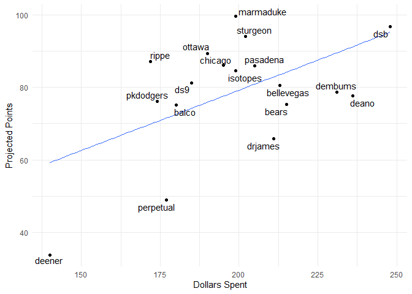

Fantasy 2019
================

#### Today's auction

| Name             |  marginal.total.points|  dollar.value|
|:-----------------|----------------------:|-------------:|
| Rougned Odor     |                   7.57|         20.85|
| Andrew McCutchen |                   8.02|         22.07|
| Alex Verdugo     |                   4.44|         12.23|
| Avisail Garcia   |                   4.64|         12.78|
| Hunter Renfroe   |                   5.79|         15.93|
| Tyler Flowers    |                   2.16|          5.95|
| Corey Knebel     |                   6.47|         17.82|
| Mike Zunino      |                   3.22|          8.88|

#### Draft Status

| position     |  remaining|   max|   avg|
|:-------------|----------:|-----:|-----:|
| catcher      |         25|   8.9|   5.3|
| dh           |          8|  18.8|  11.4|
| first\_base  |         12|  16.4|  10.0|
| outfield     |         50|  22.1|   9.8|
| second\_base |          8|  20.9|   7.3|
| shortstop    |          9|  13.5|   8.3|
| third\_base  |         11|  13.9|   8.9|
| pitcher      |         88|  17.8|   6.0|

| Position |  Still\_to\_be\_Drafted|
|:---------|-----------------------:|
| 1B       |                       3|
| 2B       |                       5|
| 3B       |                       1|
| CI       |                      10|
| DH       |                      15|
| MI       |                       9|
| SS       |                       2|
| C        |                      23|
| OF       |                      36|
| P        |                      72|

#### Current Standings

| team\_name |  spent|  left|  picks.left|  max\_bid|  total\_points|  hit.points|  pitch.points|
|:-----------|------:|-----:|-----------:|---------:|--------------:|-----------:|-------------:|
| allrise    |    219|    41|          12|        30|           90.1|        41.9|          48.2|
| rippe      |    219|    41|          11|        31|           84.6|        29.8|          54.8|
| ottawa     |    192|    68|          12|        57|           81.9|        30.9|          51.0|
| marmaduke  |    216|    44|          11|        34|           81.5|        41.3|          40.2|
| dsb        |    238|    22|           9|        14|           80.8|        35.5|          45.3|
| deener     |    250|    10|           5|         6|           80.3|        24.3|          56.0|
| isotopes   |    208|    52|          11|        42|           79.6|        43.2|          36.4|
| pkdodgers  |    234|    26|           5|        22|           75.5|        25.0|          50.5|
| dembums    |    217|    43|          13|        31|           74.5|        32.8|          41.7|
| jobu       |    248|    12|           5|         8|           73.9|        33.1|          40.8|
| sturgeon   |    208|    52|          11|        42|           73.6|        46.7|          26.9|
| pasadena   |    206|    54|          13|        42|           72.9|        45.3|          27.6|
| chicago    |    201|    59|           8|        52|           72.8|        43.9|          28.9|
| deano      |    219|    41|          12|        30|           61.4|        22.9|          38.5|
| bears      |    166|    94|          12|        83|           59.6|        21.1|          38.5|
| bellevegas |    209|    51|           7|        45|           58.7|        24.2|          34.5|
| balco      |    207|    53|          10|        44|           56.7|        23.9|          32.8|
| hermanos   |    202|    58|           9|        50|           44.3|        19.8|          24.5|

#### Top Remaining Pitchers

| Name              | Team      |   IP|   ERA|  WHIP|    K|   SV|    W|   pts|    dlr|
|:------------------|:----------|----:|-----:|-----:|----:|----:|----:|-----:|------:|
| Corey Knebel      | Brewers   |   65|  3.05|  1.16|   92|   23|    4|  6.47|  17.82|
| Brandon Morrow    | Cubs      |   60|  3.43|  1.21|   64|   30|    3|  5.91|  16.26|
| Anthony Swarzak   | Mariners  |   65|  3.87|  1.28|   66|   31|    3|  5.58|  15.37|
| Trevor May        | Twins     |   65|  3.97|  1.25|   70|   30|    3|  5.58|  15.35|
| Marco Gonzales    | Mariners  |  180|  4.08|  1.28|  149|    0|   11|  5.42|  14.93|
| Drew Steckenrider | Marlins   |   65|  3.52|  1.25|   74|   26|    3|  5.30|  14.59|
| Steven Matz       | Mets      |  162|  4.04|  1.29|  155|    0|   10|  5.19|  14.28|
| Joe Musgrove      | Pirates   |  162|  4.03|  1.27|  141|    0|   10|  4.95|  13.63|
| Mychal Givens     | Orioles   |   65|  4.05|  1.30|   69|   28|    3|  4.87|  13.39|
| Dellin Betances   | Yankees   |   75|  2.85|  1.12|  112|    6|    5|  4.84|  13.32|
| Alex Wood         | Reds      |  152|  3.99|  1.31|  138|    0|   10|  4.46|  12.28|
| Marcus Stroman    | Blue Jays |  196|  4.14|  1.38|  149|    0|   12|  4.33|  11.92|
| Danny Duffy       | Royals    |  185|  4.35|  1.33|  162|    0|   10|  4.27|  11.76|
| Shane Greene      | Tigers    |   65|  4.24|  1.35|   62|   28|    3|  4.25|  11.69|
| Collin McHugh     | Astros    |  151|  4.29|  1.29|  142|    0|   10|  4.24|  11.67|

#### Top Remaining Hitters

| Name              | Team         |   PA|    R|   HR|  RBI|   SB|    AVG|   pts|    dlr|
|:------------------|:-------------|----:|----:|----:|----:|----:|------:|-----:|------:|
| Andrew McCutchen  | Phillies     |  595|   81|   26|   76|   11|  0.263|  8.02|  22.07|
| Rougned Odor      | Rangers      |  644|   79|   28|   86|   16|  0.249|  7.57|  20.85|
| Jarrod Dyson      | Diamondbacks |  596|   61|    7|   52|   33|  0.253|  6.98|  19.23|
| Kendrys Morales   | Blue Jays    |  630|   78|   28|   86|    3|  0.249|  6.84|  18.84|
| Corey Dickerson   | Pirates      |  595|   72|   21|   76|    6|  0.275|  6.66|  18.33|
| Mark Trumbo       | Orioles      |  595|   70|   29|   83|    1|  0.247|  6.01|  16.55|
| Justin Smoak      | Blue Jays    |  644|   81|   29|   86|    1|  0.239|  5.98|  16.45|
| Kevin Kiermaier   | Rays         |  609|   71|   15|   62|   18|  0.238|  5.84|  16.09|
| Kevin Pillar      | Blue Jays    |  609|   67|   15|   66|   14|  0.258|  5.82|  16.03|
| Hunter Renfroe    | Padres       |  567|   66|   28|   80|    3|  0.246|  5.79|  15.93|
| Josh Bell         | Pirates      |  616|   73|   19|   76|    5|  0.270|  5.62|  15.48|
| Kole Calhoun      | Angels       |  630|   79|   21|   71|    6|  0.243|  5.53|  15.21|
| Ryan McMahon      | Rockies      |  583|   68|   17|   72|    7|  0.270|  5.32|  14.64|
| Steven Souza Jr.  | Diamondbacks |  560|   65|   20|   67|   11|  0.239|  5.24|  14.42|
| Enrique Hernandez | Dodgers      |  583|   70|   22|   73|    4|  0.247|  5.18|  14.25|

#### Dollars vs. projected points

#### Remaining Picks vs. projected points

#### Unmatched Draft Picks

    ## # A tibble: 16 x 3
    ##    player                team      error      
    ##    <chr>                 <chr>     <chr>      
    ##  1 Luis Robert           allrise   not matched
    ##  2 Royce Lewis           bears     not matched
    ##  3 Brendan McKay         chicago   not matched
    ##  4 Keston Hiura          chicago   not matched
    ##  5 Taylor Trammell       deano     not matched
    ##  6 Forest Whitley        dembums   not matched
    ##  7 Sixto Sanchez         hermanos  not matched
    ##  8 Vladimir Guerrero Jr. ottawa    not matched
    ##  9 Brendan Rodgers       pasadena  not matched
    ## 10 Austin Riley          pasadena  not matched
    ## 11 Yusei Kikuchi         rippe     not matched
    ## 12 Bo Bichette           sturgeon  not matched
    ## 13 Nick Senzel           marmaduke not matched
    ## 14 Michael Kopech        deano     not matched
    ## 15 Kyler Murray          bears     not matched
    ## 16 Peter Alonso          sturgeon  not matched
