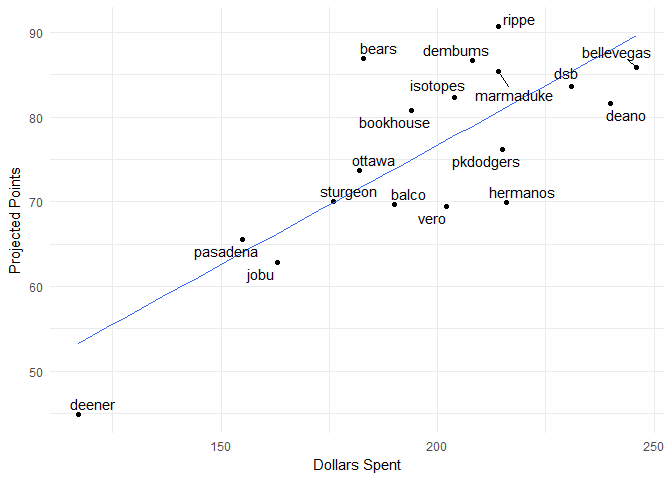

#### Current Standings

    ##     team_name spent left picks.left total_points hit.points pitch.points
    ## 1     dembums   208   52         14         86.7       58.5         28.2
    ## 2       deano   240   20         12         81.6       43.3         38.3
    ## 3       rippe   176   84         13         79.2       45.0         34.2
    ## 4         dsb   213   47         13         78.9       45.7         33.2
    ## 5   marmaduke   182   78         13         75.8       42.4         33.4
    ## 6  bellevegas   193   67         10         72.8       46.9         25.9
    ## 7   bookhouse   156  104         13         69.9       37.3         32.6
    ## 8   pkdodgers   193   67          9         68.9       40.8         28.1
    ## 9        vero   184   76         12         68.1       38.6         29.5
    ## 10   isotopes   144  116         12         67.3       38.5         28.8
    ## 11     ottawa   138  122         13         65.3       33.4         31.9
    ## 12   hermanos   192   68         12         65.2       35.4         29.8
    ## 13      bears    91  169         15         64.2       38.8         25.4
    ## 14      balco   161   99         11         62.7       40.0         22.7
    ## 15   sturgeon   144  116         15         62.1       34.4         27.7
    ## 16   pasadena   123  137         16         61.4       38.5         22.9
    ## 17       jobu   133  127         14         55.6       16.2         39.4
    ## 18     deener   108  152         15         42.0       22.1         19.9

#### Top Remaining Pitchers

    ##                name         Team  IP  ERA WHIP   K SV  W  pts   dlr
    ## 1   Carlos Carrasco      Indians 178 3.48 1.15 191  0 13 5.40 14.88
    ## 2    Brandon Morrow         Cubs  65 3.55 1.22  68 32  4 4.60 12.67
    ## 3   Jeff Samardzija       Giants 205 3.75 1.18 186  0 12 4.52 12.45
    ## 4    Kelvin Herrera       Royals  65 3.82 1.27  65 30  3 3.60  9.91
    ## 5        Cody Allen      Indians  65 3.65 1.21  78 25  4 3.57  9.84
    ## 6       Gerrit Cole      Pirates 200 3.90 1.25 189  0 12 3.50  9.65
    ## 7    Jeurys Familia         Mets  65 3.57 1.33  65 30  3 3.49  9.62
    ## 8     Cam Bedrosian       Angels  65 3.64 1.28  69 26  3 3.03  8.35
    ## 9     Mark Melancon       Giants  65 3.32 1.23  58 25  3 2.97  8.19
    ## 10     Shane Greene       Tigers  65 3.94 1.31  65 27  3 2.86  7.87
    ## 11   Brad Boxberger Diamondbacks  65 4.11 1.35  74 27  3 2.81  7.75
    ## 12  Fernando Rodney        Twins  65 4.18 1.42  64 29  3 2.65  7.30
    ## 13    Danny Salazar      Indians 124 3.51 1.20 152  0  9 2.59  7.13
    ## 14      Tyler Lyons    Cardinals  65 3.70 1.21  68 22  3 2.55  7.01
    ## 15  Lance McCullers       Astros 148 3.68 1.30 158  0 11 2.35  6.47
    ## 16     Alex Claudio      Rangers  65 3.97 1.38  48 27  3 2.22  6.11
    ## 17 Santiago Casilla    Athletics  65 4.33 1.37  60 25  3 1.98  5.45
    ## 18  Jameson Taillon      Pirates 160 3.88 1.27 148  0 10 1.91  5.25
    ## 19      Blake Snell         Rays 157 3.78 1.32 163  0 10 1.89  5.19
    ## 20      Juan Minaya    White Sox  65 4.80 1.44  62 27  3 1.87  5.16

#### Top Remaining Hitters

    ##                name     Team  PA  R HR RBI SB   AVG  pts   dlr
    ## 1    Starling Marte  Pirates 598 75 16  67 29 0.287 8.25 22.72
    ## 2       Ian Desmond  Rockies 600 77 22  79 16 0.283 7.82 21.53
    ## 3        Ryan Braun  Brewers 582 77 27  84 13 0.276 7.47 20.56
    ## 4       Evan Gattis   Astros 566 75 31  89  2 0.255 7.47 20.55
    ## 5  Christian Yelich  Marlins 646 81 18  79 11 0.292 7.32 20.15
    ## 6     Adrian Beltre  Rangers 618 80 23  91  2 0.287 7.31 20.13
    ## 7   Yoenis Cespedes     Mets 614 81 33  93  3 0.271 7.13 19.62
    ## 8       Eric Hosmer     <NA> 646 83 26  94  4 0.290 7.11 19.56
    ## 9       DJ LeMahieu  Rockies 661 87 10  64 10 0.310 7.03 19.34
    ## 10  Xander Bogaerts  Red Sox 628 79 16  77 10 0.289 6.96 19.17
    ## 11     Lorenzo Cain     <NA> 599 74 15  69 16 0.288 6.72 18.49
    ## 12      Jean Segura Mariners 628 79 14  59 21 0.275 6.58 18.10
    ## 13      Jose Peraza     Reds 640 64  8  60 28 0.278 6.47 17.80
    ## 14       David Dahl  Rockies 534 67 19  74 13 0.284 6.38 17.57
    ## 15    Jorge Polanco    Twins 628 73 15  74 13 0.273 6.01 16.54
    ## 16    Shin-Soo Choo  Rangers 638 88 22  72 10 0.260 5.93 16.32
    ## 17  Kevin Kiermaier     Rays 626 76 18  68 20 0.257 5.91 16.26
    ## 18   Odubel Herrera Phillies 629 74 15  67 14 0.276 5.75 15.82
    ## 19 Michael Brantley  Indians 505 65 15  68 10 0.292 5.74 15.81
    ## 20     Josh Reddick   Astros 558 74 19  74  7 0.278 5.68 15.64

#### Dollars vs. projected points

#### Data entry errors

    ##                   player       team       error
    ## 1        Brendan Rodgers      rippe not matched
    ## 2            Nick Senzel   sturgeon not matched
    ## 3            Alec Hansen  pkdodgers not matched
    ## 4         Michael Kopech  pkdodgers not matched
    ## 5       Delino Deshields     ottawa not matched
    ## 6  Vladimir Guerrero Jr.     ottawa not matched
    ## 7           Kolby Allard       jobu not matched
    ## 8           Kevin Maitan      deano not matched
    ## 9           Eloy Jimenez bellevegas not matched
    ## 10    Anthony DeScalfani  pkdodgers not matched
    ## 11             Darin Ruf   isotopes not matched
