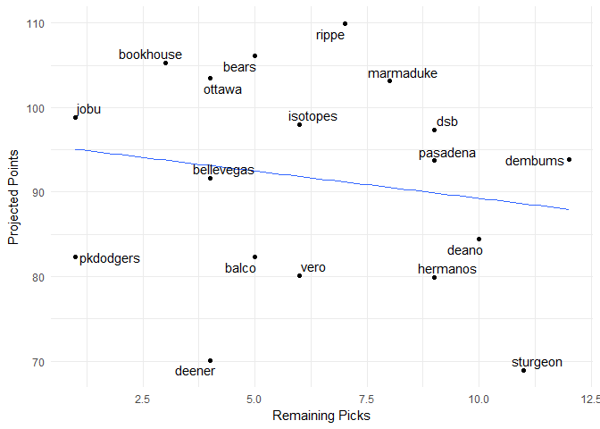

#### Current Standings

    ##     team_name spent left picks.left total_points hit.points pitch.points
    ## 1       rippe   242   18          8        107.4       72.7         34.7
    ## 2      ottawa   237   23          4        103.5       64.7         38.8
    ## 3       bears   212   48          9         99.5       69.4         30.1
    ## 4   marmaduke   237   23          9         98.5       63.0         35.5
    ## 5        jobu   254    6          2         97.3       44.5         52.8
    ## 6         dsb   257    3         10         96.5       61.6         34.9
    ## 7   bookhouse   227   33          7         95.6       52.3         43.3
    ## 8     dembums   227   33         12         93.8       61.8         32.0
    ## 9    pasadena   216   44         10         91.7       64.5         27.2
    ## 10   isotopes   220   40          8         91.6       53.2         38.4
    ## 11 bellevegas   252    8          4         91.6       51.8         39.8
    ## 12      deano   249   11         10         84.4       45.5         38.9
    ## 13      balco   230   30          5         82.3       48.9         33.4
    ## 14  pkdodgers   239   21          2         79.3       42.4         36.9
    ## 15       vero   232   28          7         79.0       42.3         36.7
    ## 16   hermanos   230   30         10         75.6       39.1         36.5
    ## 17   sturgeon   180   80         12         67.1       35.7         31.4
    ## 18     deener   191   69          8         63.4       38.5         24.9

#### Top Remaining Pitchers

    ##                 name         Team  IP  ERA WHIP   K SV  W  pts  dlr
    ## 1     Brad Boxberger Diamondbacks  65 4.10 1.34  74 27  3 2.86 7.87
    ## 2       Alex Claudio      Rangers  65 3.97 1.38  48 27  3 2.22 6.11
    ## 3        Juan Minaya    White Sox  65 4.79 1.44  62 27  3 1.88 5.17
    ## 4          J.A. Happ    Blue Jays 171 4.11 1.29 154  0 11 1.80 4.95
    ## 5       Brad Ziegler      Marlins  65 3.99 1.47  43 27  3 1.76 4.85
    ## 6        Sean Manaea    Athletics 173 4.16 1.33 149  0 11 1.21 3.34
    ## 7        Danny Duffy       Royals 180 4.32 1.31 156  0 10 1.05 2.88
    ## 8       Tyler Skaggs       Angels 154 4.13 1.31 138  0 10 1.04 2.87
    ## 9   Santiago Casilla    Athletics  65 4.33 1.37  60 19  3 0.93 2.56
    ## 10       Ryan Madson    Nationals  65 3.26 1.18  70  9  4 0.91 2.50
    ## 11     Blake Treinen    Athletics  65 3.65 1.35  63 16  3 0.88 2.43
    ## 12       Brett Cecil    Cardinals  65 3.50 1.23  66 12  3 0.78 2.14
    ## 13    Mike Clevinger      Indians 169 4.46 1.38 168  0 11 0.76 2.08
    ## 14     Julio Teheran       Braves 179 4.40 1.32 152  0 10 0.75 2.08
    ## 15     Marco Estrada    Blue Jays 183 4.70 1.33 165  0 11 0.74 2.03
    ## 16     Andrew Heaney       Angels 136 4.24 1.28 121  0  9 0.62 1.70
    ## 17    Dinelson Lamet       Padres 140 4.16 1.35 157  0  8 0.62 1.70
    ## 18 Jordan Montgomery      Yankees 170 4.50 1.36 153  0 11 0.57 1.58
    ## 19   Clayton Richard       Padres 191 3.94 1.39 140  0 10 0.31 0.85
    ## 20        Pat Neshek     Phillies  65 3.92 1.18  68  9  3 0.27 0.75

#### Top Remaining Hitters

    ##                 name         Team  PA  R HR RBI SB   AVG  pts   dlr
    ## 1      Jorge Polanco        Twins 644 75 16  74 14 0.274 6.29 17.30
    ## 2      Dexter Fowler    Cardinals 623 85 17  71 11 0.262 5.59 15.38
    ## 3       Josh Reddick       Astros 560 69 17  72  6 0.282 5.33 14.66
    ## 4     Dustin Pedroia      Red Sox 595 70 12  67  6 0.293 5.27 14.50
    ## 5        Mark Trumbo      Orioles 581 74 31  87  1 0.253 5.25 14.45
    ## 6        Neil Walker         <NA> 595 74 22  77  3 0.270 5.16 14.20
    ## 7       Raimel Tapia      Rockies 490 54  8  55 16 0.296 5.02 13.83
    ## 8      Josh Harrison      Pirates 560 65 11  53 12 0.277 4.71 12.98
    ## 9      Yasmany Tomas Diamondbacks 525 63 24  78  4 0.265 4.68 12.89
    ## 10      Raul Mondesi       Royals 574 60 14  59 30 0.239 4.66 12.84
    ## 11  Cheslor Cuthbert       Royals 651 70 18  72  3 0.262 4.51 12.43
    ## 12 Christian Vazquez      Red Sox 448 53  8  50  6 0.273 4.30 11.85
    ## 13     Mikie Mahtook       Tigers 630 69 16  72  8 0.259 4.26 11.74
    ## 14      Hunter Pence       Giants 595 64 19  74  4 0.264 4.13 11.37
    ## 15     Jose Iglesias       Tigers 595 63  8  58 12 0.274 4.12 11.35
    ## 16      Jason Kipnis      Indians 560 73 15  60 10 0.259 4.07 11.20
    ## 17  Asdrubal Cabrera         Mets 595 66 18  67  4 0.262 3.99 10.99
    ## 18         Joe Panik       Giants 581 70 11  58  4 0.281 3.90 10.72
    ## 19      Brandon Moss       Royals 595 70 30  82  3 0.231 3.89 10.70
    ## 20      Steve Pearce    Blue Jays 539 67 22  73  2 0.257 3.86 10.63

#### Top Remaining MI

    ##                name         Team  PA  R HR RBI SB   AVG  pts   dlr
    ## 1     Jorge Polanco        Twins 644 75 16  74 14 0.274 6.29 17.30
    ## 2    Dustin Pedroia      Red Sox 595 70 12  67  6 0.293 5.27 14.50
    ## 3       Neil Walker         <NA> 595 74 22  77  3 0.270 5.16 14.20
    ## 4      Raul Mondesi       Royals 574 60 14  59 30 0.239 4.66 12.84
    ## 5     Jose Iglesias       Tigers 595 63  8  58 12 0.274 4.12 11.35
    ## 6      Jason Kipnis      Indians 560 73 15  60 10 0.259 4.07 11.20
    ## 7  Asdrubal Cabrera         Mets 595 66 18  67  4 0.262 3.99 10.99
    ## 8         Joe Panik       Giants 581 70 11  58  4 0.281 3.90 10.72
    ## 9      Devon Travis    Blue Jays 455 61 12  51  7 0.282 3.65 10.06
    ## 10  Troy Tulowitzki    Blue Jays 546 62 20  68  2 0.259 3.57  9.84
    ## 11 Brandon Phillips         <NA> 490 52 10  51 10 0.280 3.37  9.27
    ## 12     Chris Owings Diamondbacks 485 51 10  53 13 0.263 3.17  8.73
    ## 13      Brad Miller         Rays 560 65 20  66  7 0.238 3.15  8.66
    ## 14     Jordy Mercer      Pirates 595 59 13  62  3 0.262 2.97  8.17
    ## 15    Dixon Machado       Tigers 574 60  7  52 10 0.263 2.94  8.08
    ## 16  Alcides Escobar         <NA> 630 58  7  59 12 0.251 2.73  7.51
    ## 17       Jed Lowrie    Athletics 595 63 11  65  1 0.264 2.71  7.45
    ## 18   Dansby Swanson       Braves 560 51 10  55  6 0.254 1.97  5.43
    ## 19    Freddy Galvis       Padres 525 51 12  50 10 0.245 1.86  5.12
    ## 20      Chad Pinder    Athletics 469 50 15  54  5 0.245 1.68  4.61

#### Top Remaining C

    ##                  name      Team  PA  R HR RBI SB   AVG  pts   dlr
    ## 1   Christian Vazquez   Red Sox 448 53  8  50  6 0.273 4.30 11.85
    ## 2        Jason Castro     Twins 576 66 15  63  2 0.231 3.44  9.47
    ## 3        James McCann    Tigers 480 50 13  53  3 0.248 3.06  8.43
    ## 4      Russell Martin Blue Jays 448 54 17  55  3 0.231 2.82  7.75
    ## 5     Travis d'Arnaud      Mets 384 40 14  47  1 0.253 2.52  6.94
    ## 6        Matt Wieters Nationals 448 45 13  51  2 0.245 2.47  6.81
    ## 7      Chris Iannetta   Rockies 320 39 13  41  1 0.255 2.24  6.17
    ## 8  Francisco Cervelli   Pirates 384 37  6  37  3 0.266 2.10  5.79
    ## 9       Bruce Maxwell Athletics 416 43  8  41  2 0.249 1.75  4.82
    ## 10    Tucker Barnhart      Reds 352 33  7  35  2 0.255 1.30  3.59
    ## 11       Stephen Vogt   Brewers 256 29 10  33  1 0.257 1.29  3.54
    ## 12        Kurt Suzuki    Braves 286 28  8  34  1 0.255 1.05  2.89
    ## 13   Martin Maldonado    Angels 384 41 11  40  2 0.225 0.73  2.01
    ## 14       Caleb Joseph   Orioles 320 34  9  35  2 0.238 0.71  1.96
    ## 15      Roberto Perez   Indians 320 37  9  35  3 0.228 0.41  1.14
    ## 16         John Hicks    Tigers 233 23  6  26  3 0.250 0.32  0.87
    ## 17    Steve Clevenger      <NA> 256 24  4  25  2 0.256 0.31  0.84
    ## 18         Manny Pina   Brewers 256 24  6  27  2 0.251 0.28  0.78
    ## 19       Cameron Rupp  Phillies 320 32 12  38  1 0.222 0.05  0.15
    ## 20     Devin Mesoraco      Reds 256 28 10  32  2 0.231 0.05  0.13

#### Top Remaining OF

    ##                 name         Team  PA  R HR RBI SB   AVG  pts   dlr
    ## 1      Dexter Fowler    Cardinals 623 85 17  71 11 0.262 5.59 15.38
    ## 2       Josh Reddick       Astros 560 69 17  72  6 0.282 5.33 14.66
    ## 3        Mark Trumbo      Orioles 581 74 31  87  1 0.253 5.25 14.45
    ## 4       Raimel Tapia      Rockies 490 54  8  55 16 0.296 5.02 13.83
    ## 5      Yasmany Tomas Diamondbacks 525 63 24  78  4 0.265 4.68 12.89
    ## 6      Mikie Mahtook       Tigers 630 69 16  72  8 0.259 4.26 11.74
    ## 7       Hunter Pence       Giants 595 64 19  74  4 0.264 4.13 11.37
    ## 8       Brandon Moss       Royals 595 70 30  82  3 0.231 3.89 10.70
    ## 9       Steve Pearce    Blue Jays 539 67 22  73  2 0.257 3.86 10.63
    ## 10     Jason Heyward         Cubs 560 61 14  63  9 0.266 3.85 10.61
    ## 11       Jose Pirela       Padres 560 61 16  60 10 0.263 3.81 10.50
    ## 12       Jorge Soler       Royals 574 65 24  70  2 0.241 3.03  8.34
    ## 13       Alex Gordon       Royals 616 65 18  64  8 0.238 2.85  7.83
    ## 14   Carlos Gonzalez         <NA> 455 54 18  62  2 0.257 2.54  6.99
    ## 15     Melky Cabrera         <NA> 420 50 10  49  1 0.286 2.47  6.81
    ## 16     Nick Markakis       Braves 595 58 10  59  2 0.265 2.34  6.44
    ## 17        Seth Smith         <NA> 490 62 16  55  3 0.252 2.24  6.17
    ## 18     Gerardo Parra      Rockies 371 42  9  45  5 0.281 2.07  5.70
    ## 19 Lonnie Chisenhall      Indians 420 48 13  52  4 0.264 2.03  5.60
    ## 20        Adam Engel    White Sox 595 58 12  53 23 0.208 1.79  4.93

#### Dollars vs. projected points

#### Remaining Picks vs. projected points

#### Data entry errors

    ##                   player      team       error
    ## 1        Brendan Rodgers     rippe not matched
    ## 2            Nick Senzel  sturgeon not matched
    ## 3            Alec Hansen pkdodgers not matched
    ## 4         Michael Kopech pkdodgers not matched
    ## 5  Vladimir Guerrero Jr.    ottawa not matched
    ## 6           Kolby Allard      jobu not matched
    ## 7           Kevin Maitan     deano not matched
    ## 8              John Jaso  isotopes not matched
    ## 9                 AJ Puk    ottawa not matched
    ## 10         Scott Kingery  sturgeon not matched
    ## 11          Mitch Keller pkdodgers not matched
    ## 12           Julio Urias     deano not matched
