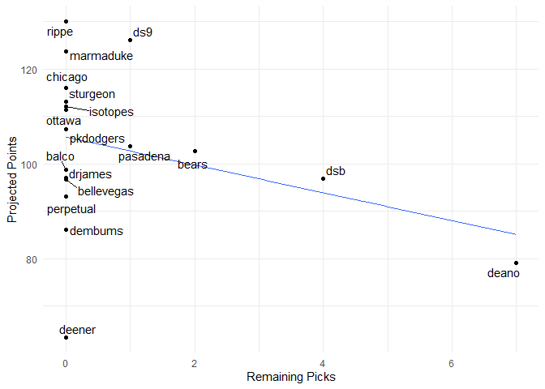

Fantasy 2020
================

\#\#\#\#Today’s auction

| Name             | marginal.total.points | dollar.value |
| :--------------- | --------------------: | -----------: |
| Wilmer Flores    |                  1.75 |         4.81 |
| Clint Frazier    |                    NA |           NA |
| Adrian Houser    |                  4.75 |        13.08 |
| Shed Long        |                  1.30 |         3.58 |
| Brandon Belt     |                  3.01 |         8.29 |
| Jasson Dominguez |                    NA |           NA |
| Nick Anderson    |                  5.04 |        13.88 |
| Seth Lugo        |                  2.36 |         6.49 |

\#\#\#\#Draft Status

| position     | remaining |  max |  avg |
| :----------- | --------: | ---: | ---: |
| catcher      |        10 |  5.0 |  2.7 |
| dh           |         2 | 13.2 | 11.1 |
| first\_base  |         9 |  8.9 |  5.2 |
| outfield     |        28 | 12.7 |  5.8 |
| second\_base |         3 |  9.4 |  6.3 |
| shortstop    |         8 | 10.1 |  5.7 |
| third\_base  |         6 |  8.1 |  4.4 |
| pitcher      |        77 | 16.8 |  5.6 |

| Position | Still\_to\_be\_Drafted |
| :------- | ---------------------: |
| 1B       |                      2 |
| 2B       |                      3 |
| 3B       |                      1 |
| CI       |                      5 |
| DH       |                      6 |
| MI       |                      3 |
| SS       |                      0 |
| C        |                      6 |
| OF       |                      6 |
| P        |                     40 |
| Total    |                     72 |

\#\#\#\#Current Standings

| team\_name | spent | left | picks.left | max\_bid | total\_points | hit.points | pitch.points |
| :--------- | ----: | ---: | ---------: | -------: | ------------: | ---------: | -----------: |
| rippe      |   257 |    3 |          3 |        1 |         123.6 |       59.8 |         63.8 |
| chicago    |   246 |   14 |          2 |       13 |         118.0 |       69.3 |         48.7 |
| ottawa     |   258 |    2 |          3 |        0 |         116.0 |       55.8 |         60.2 |
| ds9        |   253 |    7 |          4 |        4 |         115.9 |       46.5 |         69.4 |
| isotopes   |   247 |   13 |          5 |        9 |         115.5 |       62.1 |         53.4 |
| marmaduke  |   235 |   25 |          6 |       20 |         115.2 |       62.2 |         53.0 |
| sturgeon   |   242 |   18 |          5 |       14 |         108.9 |       67.9 |         41.0 |
| pkdodgers  |   255 |    5 |          0 |        6 |         108.1 |       49.8 |         58.3 |
| balco      |   241 |   19 |          2 |       18 |         102.4 |       54.6 |         47.8 |
| dsb        |   250 |   10 |          5 |        6 |          97.5 |       35.0 |         62.5 |
| bears      |   245 |   15 |          7 |        9 |          97.1 |       49.6 |         47.5 |
| bellevegas |   257 |    3 |          2 |        2 |          96.9 |       47.5 |         49.4 |
| dembums    |   245 |   15 |          6 |       10 |          94.3 |       44.0 |         50.3 |
| perpetual  |   258 |    2 |          0 |        3 |          91.1 |       45.2 |         45.9 |
| pasadena   |   229 |   31 |          7 |       25 |          90.0 |       52.9 |         37.1 |
| drjames    |   249 |   11 |          7 |        5 |          81.5 |       39.4 |         42.1 |
| deano      |   252 |    8 |          8 |        1 |          80.8 |       62.3 |         18.5 |
| deener     |   245 |   15 |          0 |       16 |          64.0 |       31.8 |         32.2 |

\#\#\#\#Top Remaining Pitchers

| Name            | Team         |  IP |  ERA | WHIP |   K | SV |  W |  pts |   dlr |
| :-------------- | :----------- | --: | ---: | ---: | --: | -: | -: | ---: | ----: |
| Johnny Cueto    | Giants       | 182 | 4.08 | 1.31 | 162 |  0 | 10 | 6.09 | 16.77 |
| Nick Anderson   | Rays         |  65 | 2.92 | 1.05 |  97 |  9 |  4 | 5.04 | 13.88 |
| Pablo Lopez     | Marlins      | 157 | 4.04 | 1.27 | 139 |  0 |  8 | 4.75 | 13.09 |
| Adrian Houser   | Brewers      | 165 | 4.34 | 1.37 | 157 |  0 | 10 | 4.75 | 13.08 |
| Danny Duffy     | Royals       | 184 | 4.58 | 1.36 | 163 |  0 | 10 | 4.55 | 12.53 |
| Jakob Junis     | Royals       | 182 | 4.80 | 1.35 | 166 |  0 | 10 | 4.40 | 12.11 |
| Mike Fiers      | Athletics    | 191 | 4.86 | 1.36 | 148 |  0 | 12 | 4.36 | 11.99 |
| Tanner Roark    | Blue Jays    | 181 | 4.78 | 1.35 | 158 |  0 | 10 | 4.15 | 11.42 |
| Kyle Gibson     | Rangers      | 174 | 4.67 | 1.43 | 164 |  0 | 10 | 3.65 | 10.04 |
| Adam Wainwright | Cardinals    | 154 | 4.44 | 1.39 | 133 |  0 | 10 | 3.55 |  9.77 |
| Mike Leake      | Diamondbacks | 175 | 4.60 | 1.32 | 119 |  0 | 10 | 3.44 |  9.47 |
| Eric Lauer      | Brewers      | 160 | 4.61 | 1.38 | 148 |  0 |  9 | 3.42 |  9.41 |
| Reynaldo Lopez  | White Sox    | 159 | 4.71 | 1.36 | 145 |  0 |  9 | 3.38 |  9.30 |
| Chase Anderson  | Blue Jays    | 169 | 4.95 | 1.37 | 148 |  0 | 10 | 3.35 |  9.22 |
| Anibal Sanchez  | Nationals    | 163 | 4.69 | 1.37 | 145 |  0 |  9 | 3.26 |  8.98 |

\#\#\#\#Top Remaining Hitters

| Name             | Team      |  PA |  R | HR | RBI | SB |   AVG |  pts |   dlr |
| :--------------- | :-------- | --: | -: | -: | --: | -: | ----: | ---: | ----: |
| Miguel Cabrera   | Tigers    | 595 | 68 | 19 |  76 |  1 | 0.283 | 4.78 | 13.15 |
| Dexter Fowler    | Cardinals | 637 | 75 | 20 |  70 | 10 | 0.235 | 4.60 | 12.67 |
| Nick Markakis    | Braves    | 609 | 68 | 13 |  72 |  2 | 0.280 | 4.00 | 11.02 |
| Steven Souza Jr. | NA        | 504 | 61 | 20 |  65 | 10 | 0.238 | 3.84 | 10.57 |
| Jose Iglesias    | Orioles   | 595 | 60 | 10 |  60 | 10 | 0.270 | 3.66 | 10.07 |
| Ian Happ         | Cubs      | 504 | 63 | 22 |  65 |  7 | 0.237 | 3.50 |  9.64 |
| Cesar Hernandez  | Indians   | 574 | 67 | 11 |  57 | 11 | 0.273 | 3.43 |  9.45 |
| Albert Pujols    | Angels    | 518 | 60 | 22 |  73 |  2 | 0.248 | 3.27 |  9.01 |
| Eric Thames      | Nationals | 455 | 61 | 23 |  64 |  5 | 0.242 | 3.23 |  8.90 |
| Phillip Ervin    | Reds      | 426 | 49 | 13 |  48 | 13 | 0.246 | 3.11 |  8.56 |
| Miguel Rojas     | Marlins   | 602 | 59 | 10 |  57 |  7 | 0.272 | 3.04 |  8.36 |
| Brandon Belt     | Giants    | 560 | 66 | 18 |  63 |  4 | 0.245 | 3.01 |  8.29 |
| Todd Frazier     | Rangers   | 511 | 63 | 22 |  68 |  5 | 0.236 | 2.95 |  8.12 |
| Alex Dickerson   | Giants    | 480 | 55 | 15 |  60 |  3 | 0.269 | 2.84 |  7.83 |
| Leury Garcia     | White Sox | 420 | 47 |  8 |  39 | 13 | 0.262 | 2.83 |  7.80 |

\#\#\#\#Top CI

| Name              | Team         |  PA |  R | HR | RBI | SB |   AVG |  pts |  dlr |
| :---------------- | :----------- | --: | -: | -: | --: | -: | ----: | ---: | ---: |
| Eric Thames       | Nationals    | 455 | 61 | 23 |  64 |  5 | 0.242 | 3.23 | 8.90 |
| Brandon Belt      | Giants       | 560 | 66 | 18 |  63 |  4 | 0.245 | 3.01 | 8.29 |
| Todd Frazier      | Rangers      | 511 | 63 | 22 |  68 |  5 | 0.236 | 2.95 | 8.12 |
| Colin Moran       | Pirates      | 525 | 56 | 16 |  66 |  1 | 0.268 | 2.61 | 7.19 |
| Mitch Moreland    | NA           | 455 | 57 | 22 |  66 |  1 | 0.240 | 2.24 | 6.15 |
| Justin Smoak      | Brewers      | 475 | 60 | 22 |  66 |  1 | 0.232 | 1.88 | 5.19 |
| Wilmer Flores     | NA           | 357 | 41 | 14 |  47 |  1 | 0.281 | 1.75 | 4.81 |
| Ronald Guzman     | Rangers      | 476 | 55 | 17 |  59 |  2 | 0.242 | 1.67 | 4.61 |
| Jake Lamb         | Diamondbacks | 480 | 57 | 17 |  61 |  4 | 0.232 | 1.38 | 3.80 |
| Ryan Zimmerman    | NA           | 364 | 43 | 16 |  52 |  1 | 0.258 | 1.26 | 3.47 |
| Austin Nola       | Mariners     | 534 | 55 | 12 |  56 |  3 | 0.242 | 1.26 | 3.46 |
| Matt Duffy        | NA           | 399 | 43 |  7 |  39 |  5 | 0.273 | 1.22 | 3.37 |
| Asdrubal Cabrera  | Nationals    | 345 | 41 | 13 |  44 |  2 | 0.266 | 0.91 | 2.49 |
| Ryan O’Hearn      | Royals       | 441 | 50 | 19 |  57 |  1 | 0.232 | 0.80 | 2.19 |
| Jeimer Candelario | Tigers       | 448 | 52 | 15 |  52 |  2 | 0.237 | 0.63 | 1.72 |
| David Bote        | Cubs         | 370 | 43 | 12 |  44 |  4 | 0.245 | 0.28 | 0.76 |
| Rio Ruiz          | Orioles      | 441 | 47 | 13 |  51 |  2 | 0.242 | 0.25 | 0.70 |

\#\#\#\#Top MI

| Name             | Team     |  PA |  R | HR | RBI | SB |   AVG |  pts |   dlr |
| :--------------- | :------- | --: | -: | -: | --: | -: | ----: | ---: | ----: |
| Jose Iglesias    | Orioles  | 595 | 60 | 10 |  60 | 10 | 0.270 | 3.66 | 10.07 |
| Cesar Hernandez  | Indians  | 574 | 67 | 11 |  57 | 11 | 0.273 | 3.43 |  9.45 |
| Miguel Rojas     | Marlins  | 602 | 59 | 10 |  57 |  7 | 0.272 | 3.04 |  8.36 |
| Nicky Lopez      | Royals   | 567 | 57 |  7 |  51 |  9 | 0.269 | 2.76 |  7.61 |
| J.P. Crawford    | Mariners | 644 | 71 | 14 |  64 |  7 | 0.230 | 2.22 |  6.12 |
| Jurickson Profar | Padres   | 560 | 64 | 18 |  67 |  8 | 0.238 | 2.07 |  5.70 |
| Brandon Crawford | Giants   | 595 | 59 | 14 |  63 |  4 | 0.243 | 1.68 |  4.61 |
| Luis Urias       | Brewers  | 532 | 59 | 13 |  58 |  4 | 0.253 | 1.64 |  4.52 |
| Isan Diaz        | Marlins  | 581 | 65 | 20 |  67 |  6 | 0.229 | 1.38 |  3.79 |
| Nico Hoerner     | Cubs     | 378 | 41 |  8 |  42 |  5 | 0.269 | 0.85 |  2.34 |
| Jose Peraza      | Red Sox  | 287 | 31 |  5 |  30 |  9 | 0.273 | 0.65 |  1.78 |

\#\#\#\#Top catchers

| Name               | Team         |  PA |  R | HR | RBI | SB |   AVG |  pts |  dlr |
| :----------------- | :----------- | --: | -: | -: | --: | -: | ----: | ---: | ---: |
| Stephen Vogt       | Diamondbacks | 308 | 34 | 12 |  40 |  2 | 0.244 | 1.80 | 4.95 |
| Tony Wolters       | Rockies      | 384 | 37 |  5 |  36 |  2 | 0.249 | 1.36 | 3.75 |
| Mike Zunino        | Rays         | 422 | 46 | 19 |  53 |  1 | 0.205 | 1.31 | 3.59 |
| Jason Castro       | Angels       | 384 | 44 | 14 |  45 |  1 | 0.220 | 1.17 | 3.23 |
| Chance Sisco       | Orioles      | 307 | 35 | 10 |  35 |  1 | 0.237 | 1.02 | 2.81 |
| Austin Romine      | Tigers       | 250 | 26 |  8 |  29 |  1 | 0.254 | 0.83 | 2.30 |
| Pedro Severino     | Orioles      | 288 | 30 |  9 |  33 |  2 | 0.239 | 0.76 | 2.08 |
| Francisco Cervelli | Marlins      | 330 | 33 |  7 |  33 |  2 | 0.238 | 0.69 | 1.89 |
| Manny Pina         | Brewers      | 262 | 27 |  8 |  31 |  1 | 0.244 | 0.49 | 1.36 |
| Yan Gomes          | Nationals    | 282 | 30 | 10 |  34 |  1 | 0.233 | 0.41 | 1.13 |
| Curt Casali        | Reds         | 257 | 28 |  9 |  31 |  1 | 0.240 | 0.34 | 0.93 |

<!-- -->

\#\#\#\#Remaining Picks vs. projected points
<!-- -->

\#\#\#\#Best Draft Picks

| team       | player             | salary | dollar\_value | equity |
| :--------- | :----------------- | -----: | ------------: | -----: |
| dembums    | Carlos Martinez    |     16 |         33.32 |  17.32 |
| pkdodgers  | Miles Mikolas      |      7 |         22.52 |  15.52 |
| bellevegas | Clayton Kershaw    |     28 |         43.36 |  15.36 |
| sturgeon   | Dylan Bundy        |      5 |         19.78 |  14.78 |
| isotopes   | Nathan Eovaldi     |      2 |         15.84 |  13.84 |
| perpetual  | Steven Matz        |      3 |         16.80 |  13.80 |
| pkdodgers  | Kenley Jansen      |     20 |         33.71 |  13.71 |
| ds9        | Max Scherzer       |     39 |         52.39 |  13.39 |
| ottawa     | Jeff Samardzija    |      2 |         14.96 |  12.96 |
| perpetual  | Marco Gonzales     |      2 |         14.77 |  12.77 |
| chicago    | Garrett Richards   |      6 |         18.24 |  12.24 |
| bears      | Ken Giles          |     19 |         31.17 |  12.17 |
| perpetual  | Masahiro Tanaka    |      9 |         20.99 |  11.99 |
| drjames    | Edwin Diaz         |     20 |         31.89 |  11.89 |
| ottawa     | Dee Gordon         |      5 |         16.44 |  11.44 |
| dsb        | Chris Sale         |     33 |         44.22 |  11.22 |
| marmaduke  | Craig Kimbrel      |     20 |         31.04 |  11.04 |
| deano      | Victor Reyes       |      2 |         13.02 |  11.02 |
| bears      | Jackie Bradley Jr. |      4 |         14.91 |  10.91 |
| sturgeon   | Aroldis Chapman    |     26 |         36.88 |  10.88 |

\#\#\#\#Unmatched Draft Picks

| player             | team      | error       |
| :----------------- | :-------- | :---------- |
| Nick Madrigal      | bears     | not matched |
| Alec Bohm          | bears     | not matched |
| Adley Rutschman    | bears     | not matched |
| Royce Lewis        | bears     | not matched |
| Seth Beer          | deener    | not matched |
| Jonathan India     | deener    | not matched |
| Kristian Robinson  | ds9       | not matched |
| Matt Manning       | dembums   | not matched |
| Vidal Brujan       | deano     | not matched |
| Triston Casas      | deano     | not matched |
| Nolan Gorman       | drjames   | not matched |
| Luis Patino        | isotopes  | not matched |
| Marco Luciano      | ottawa    | not matched |
| Casey Mize         | pasadena  | not matched |
| Ian Anderson       | perpetual | not matched |
| Nate Pearson       | perpetual | not matched |
| Keibert Ruiz       | pkdodgers | not matched |
| Wander Franco      | rippe     | not matched |
| Xavier Edwards     | sturgeon  | not matched |
| Andrew Vaughn      | marmaduke | not matched |
| Kwang-Hyun Kim     | pkdodgers | not matched |
| Evan White         | deener    | not matched |
| Yoshitomo Tsutsugo | ottawa    | not matched |
| Julio Rodriguez    | isotopes  | not matched |
| Forrest Whitley    | pasadena  | not matched |
| Shogo Akiyama      | ds9       | not matched |
