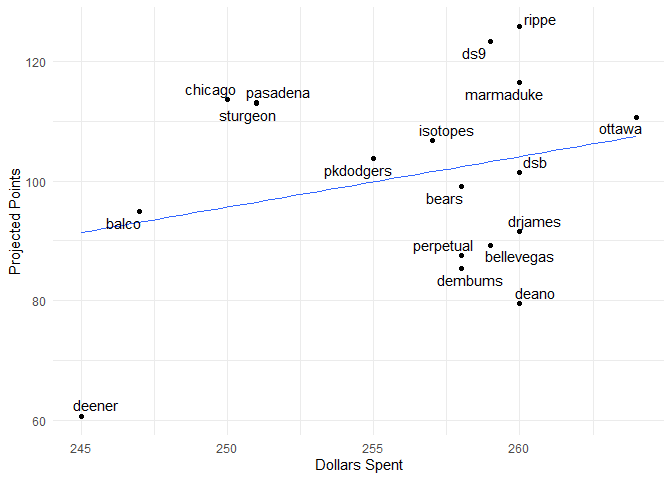
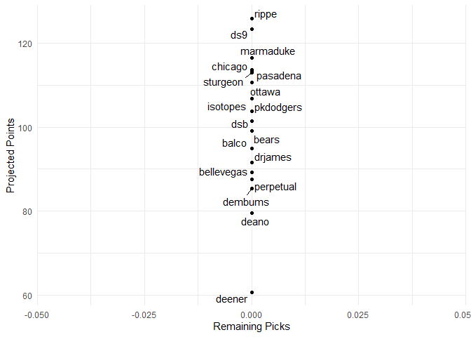

Fantasy 2020
================

#### Today's auction

#### Draft Status

| position    |  remaining|   max|  avg|
|:------------|----------:|-----:|----:|
| catcher     |          3|   3.4|  2.2|
| first\_base |          1|   4.2|  4.2|
| outfield    |          4|   3.6|  2.3|
| shortstop   |          1|   6.0|  6.0|
| pitcher     |         29|  11.8|  4.8|

| Position |  Still\_to\_be\_Drafted|
|:---------|-----------------------:|
| 1B       |                       0|
| 2B       |                       0|
| 3B       |                       0|
| CI       |                       0|
| DH       |                       0|
| MI       |                       0|
| SS       |                       0|
| C        |                       0|
| OF       |                       0|
| P        |                       0|
| Total    |                       0|

#### Current Standings

| team\_name |  total\_points|  hit.points|  pitch.points|
|:-----------|--------------:|-----------:|-------------:|
| rippe      |          125.8|        62.4|          63.4|
| ds9        |          123.4|        55.5|          67.9|
| marmaduke  |          116.5|        62.0|          54.5|
| chicago    |          113.7|        63.2|          50.5|
| pasadena   |          113.1|        66.2|          46.9|
| sturgeon   |          113.0|        68.2|          44.8|
| ottawa     |          107.5|        54.3|          53.2|
| isotopes   |          106.8|        64.5|          42.3|
| dsb        |          101.4|        36.4|          65.0|
| pkdodgers  |           99.3|        48.3|          51.0|
| bears      |           99.1|        48.2|          50.9|
| balco      |           94.9|        52.0|          42.9|
| drjames    |           91.5|        49.4|          42.1|
| bellevegas |           89.3|        45.7|          43.6|
| perpetual  |           87.5|        40.0|          47.5|
| dembums    |           85.4|        41.6|          43.8|
| deano      |           79.5|        58.3|          21.2|
| deener     |           60.7|        29.9|          30.8|

#### Top Remaining Pitchers

| Name            | Team         |   IP|   ERA|  WHIP|    K|   SV|    W|   pts|    dlr|
|:----------------|:-------------|----:|-----:|-----:|----:|----:|----:|-----:|------:|
| Jakob Junis     | Royals       |  180|  4.82|  1.35|  163|    0|   10|  4.27|  11.75|
| Danny Duffy     | Royals       |  177|  4.68|  1.37|  157|    0|   10|  4.08|  11.22|
| Eric Lauer      | Brewers      |  160|  4.66|  1.38|  149|    0|   10|  3.85|  10.60|
| Chase Anderson  | Blue Jays    |  169|  4.92|  1.36|  148|    0|    9|  3.04|   8.38|
| Matt Shoemaker  | Blue Jays    |  139|  4.64|  1.33|  131|    0|    8|  2.94|   8.11|
| Trevor Williams | Pirates      |  165|  4.62|  1.36|  130|    0|    9|  2.92|   8.04|
| Mike Leake      | Diamondbacks |  174|  4.73|  1.34|  112|    0|   10|  2.71|   7.46|
| Adam Wainwright | Cardinals    |  155|  4.53|  1.41|  131|    0|    9|  2.63|   7.24|
| Daniel Norris   | Tigers       |  160|  4.85|  1.40|  141|    0|    9|  2.54|   7.00|
| Brad Keller     | Royals       |  179|  4.59|  1.44|  134|    0|   10|  2.49|   6.84|
| Drew Smyly      | Giants       |  132|  4.46|  1.34|  133|    0|    6|  2.25|   6.20|
| Jose Urena      | Marlins      |  133|  4.42|  1.35|  106|    3|    6|  2.01|   5.54|
| Martin Perez    | Red Sox      |  165|  4.75|  1.46|  128|    0|   10|  1.95|   5.36|
| Gio Gonzalez    | White Sox    |  139|  4.63|  1.43|  123|    0|    8|  1.68|   4.64|
| Homer Bailey    | Twins        |  132|  5.01|  1.42|  111|    0|    9|  1.39|   3.83|

#### Top Remaining Hitters

| Name               | Team      |   PA|    R|   HR|  RBI|   SB|    AVG|   pts|   dlr|
|:-------------------|:----------|----:|----:|----:|----:|----:|------:|-----:|-----:|
| Miguel Rojas       | Marlins   |  539|   53|    8|   50|    7|  0.270|  2.18|  5.99|
| Darin Ruf          | Giants    |  541|   59|   19|   63|    1|  0.232|  1.52|  4.18|
| Steven Souza Jr.   | Cubs      |  363|   45|   15|   47|    7|  0.236|  1.32|  3.62|
| Tony Wolters       | Rockies   |  384|   39|    4|   36|    1|  0.249|  1.24|  3.40|
| Derek Fisher       | Blue Jays |  364|   46|   15|   43|    9|  0.227|  1.21|  3.32|
| Pedro Severino     | Orioles   |  288|   29|    9|   32|    2|  0.236|  0.58|  1.59|
| Yan Gomes          | Nationals |  282|   30|   10|   36|    1|  0.234|  0.57|  1.58|
| D.J. Stewart       | Orioles   |  343|   41|   12|   41|    6|  0.237|  0.46|  1.27|
| Tyler Naquin       | Indians   |  280|   33|    9|   35|    3|  0.268|  0.43|  1.18|
| Ronald Guzman      | Rangers   |  406|   46|   14|   48|    1|  0.239|  0.36|  0.99|
| Francisco Cervelli | Marlins   |  300|   31|    6|   30|    2|  0.237|  0.35|  0.96|
| Manny Pina         | Brewers   |  262|   26|    8|   31|    1|  0.241|  0.34|  0.93|
| Ryan Zimmerman     | Nationals |  285|   34|   12|   42|    1|  0.260|  0.18|  0.49|
| Jose Osuna         | Pirates   |  321|   37|   10|   40|    2|  0.257|  0.15|  0.41|
| Curt Casali        | Reds      |  257|   27|    8|   30|    0|  0.237|  0.11|  0.31|

#### Top CI

| Name             | Team         |   PA|    R|   HR|  RBI|   SB|    AVG|    pts|    dlr|
|:-----------------|:-------------|----:|----:|----:|----:|----:|------:|------:|------:|
| Darin Ruf        | Giants       |  541|   59|   19|   63|    1|  0.232|   1.52|   4.18|
| Ronald Guzman    | Rangers      |  406|   46|   14|   48|    1|  0.239|   0.36|   0.99|
| Ryan Zimmerman   | Nationals    |  285|   34|   12|   42|    1|  0.260|   0.18|   0.49|
| Jose Osuna       | Pirates      |  321|   37|   10|   40|    2|  0.257|   0.15|   0.41|
| Austin Nola      | Mariners     |  443|   45|   10|   44|    2|  0.238|  -0.05|  -0.15|
| T.J. Rivera      | NA           |  274|   28|    7|   32|    1|  0.266|  -0.89|  -2.44|
| Jedd Gyorko      | Brewers      |  269|   31|   11|   36|    2|  0.242|  -1.12|  -3.09|
| David Bote       | Cubs         |  236|   28|    7|   28|    3|  0.243|  -1.73|  -4.76|
| Dawel Lugo       | Tigers       |  210|   21|    4|   22|    2|  0.262|  -1.96|  -5.39|
| Matt Duffy       | Rangers      |  140|   15|    2|   13|    2|  0.275|  -2.03|  -5.59|
| Ryan McBroom     | Royals       |  196|   22|    6|   22|    1|  0.250|  -2.07|  -5.69|
| Jake Lamb        | Diamondbacks |  235|   29|    8|   31|    2|  0.232|  -2.07|  -5.70|
| Cory Spangenberg | Brewers      |  265|   19|    4|   19|    5|  0.242|  -2.27|  -6.24|
| Frank Schwindel  | Tigers       |  246|   18|    7|   21|    0|  0.252|  -2.27|  -6.24|
| David Freese     | NA           |  154|   13|    4|   15|    0|  0.266|  -2.35|  -6.46|
| Justin Bour      | NA           |  218|   18|    8|   23|    0|  0.241|  -2.55|  -7.01|
| Tommy Joseph     | Red Sox      |  223|   17|    7|   22|    0|  0.244|  -2.56|  -7.05|

#### Top MI

| Name            | Team    |   PA|    R|   HR|  RBI|   SB|    AVG|    pts|    dlr|
|:----------------|:--------|----:|----:|----:|----:|----:|------:|------:|------:|
| Miguel Rojas    | Marlins |  539|   53|    8|   50|    7|  0.270|   2.18|   5.99|
| Joey Wendle     | Rays    |  308|   33|    5|   30|    7|  0.254|  -1.23|  -3.38|
| Eric Sogard     | Brewers |  330|   37|    7|   30|    5|  0.257|  -1.37|  -3.77|
| Brian Dozier    | NA      |  280|   36|   12|   36|    4|  0.237|  -1.86|  -5.12|
| Troy Tulowitzki | NA      |  270|   28|   11|   37|    1|  0.242|  -1.92|  -5.29|
| Scooter Gennett | NA      |  259|   30|    8|   32|    1|  0.261|  -2.08|  -5.73|
| Donovan Solano  | Giants  |  227|   22|    3|   21|    1|  0.270|  -2.21|  -6.08|
| Danny Espinosa  | NA      |  352|   36|   10|   39|    6|  0.202|  -2.26|  -6.21|
| Ian Kinsler     | NA      |  300|   32|    9|   30|    5|  0.234|  -2.33|  -6.41|
| Tim Beckham     | NA      |  231|   26|    9|   28|    2|  0.240|  -2.42|  -6.66|
| Jason Kipnis    | NA      |  253|   28|    7|   30|    3|  0.246|  -2.56|  -7.06|

#### Top catchers

| Name               | Team      |   PA|    R|   HR|  RBI|   SB|    AVG|    pts|    dlr|
|:-------------------|:----------|----:|----:|----:|----:|----:|------:|------:|------:|
| Tony Wolters       | Rockies   |  384|   39|    4|   36|    1|  0.249|   1.24|   3.40|
| Pedro Severino     | Orioles   |  288|   29|    9|   32|    2|  0.236|   0.58|   1.59|
| Yan Gomes          | Nationals |  282|   30|   10|   36|    1|  0.234|   0.57|   1.58|
| Francisco Cervelli | Marlins   |  300|   31|    6|   30|    2|  0.237|   0.35|   0.96|
| Manny Pina         | Brewers   |  262|   26|    8|   31|    1|  0.241|   0.34|   0.93|
| Curt Casali        | Reds      |  257|   27|    8|   30|    0|  0.237|   0.11|   0.31|
| Austin Allen       | Athletics |  212|   23|    7|   26|    0|  0.241|  -0.21|  -0.59|
| Tomas Telis        | Twins     |  203|   14|    3|   14|    0|  0.269|  -0.23|  -0.63|
| Austin Barnes      | Dodgers   |  211|   24|    5|   22|    3|  0.227|  -0.58|  -1.59|
| Matt McBride       | NA        |  228|   25|   10|   30|    0|  0.219|  -0.66|  -1.80|
| Nick Dini          | Royals    |  190|   14|    4|   14|    2|  0.245|  -0.82|  -2.26|

#### Remaining Picks vs. projected points

#### Best Draft Picks

| team       | player           |  salary|  dollar\_value|  equity|
|:-----------|:-----------------|-------:|--------------:|-------:|
| sturgeon   | Dylan Bundy      |       5|          18.76|   13.76|
| ds9        | Max Scherzer     |      39|          52.70|   13.70|
| dsb        | Chris Sale       |      33|          45.68|   12.68|
| dembums    | Carlos Martinez  |      16|          28.47|   12.47|
| chicago    | Kevin Gausman    |       3|          15.28|   12.28|
| marmaduke  | Johnny Cueto     |       1|          13.02|   12.02|
| perpetual  | Masahiro Tanaka  |       9|          20.83|   11.83|
| chicago    | Garrett Richards |       6|          17.80|   11.80|
| perpetual  | Marco Gonzales   |       2|          13.54|   11.54|
| deano      | Tanner Roark     |       1|          12.19|   11.19|
| pasadena   | Joshua James     |       5|          15.85|   10.85|
| pasadena   | Pablo Lopez      |       3|          13.85|   10.85|
| bellevegas | Vince Velasquez  |       0|          10.80|   10.80|
| bellevegas | Clayton Kershaw  |      28|          38.62|   10.62|
| perpetual  | Rick Porcello    |       4|          14.44|   10.44|
| rippe      | Mike Fiers       |       1|          11.26|   10.26|
| ottawa     | Jeff Samardzija  |       2|          12.23|   10.23|
| sturgeon   | Josh Lindblom    |       4|          14.19|   10.19|
| dsb        | Miguel Cabrera   |       0|          10.17|   10.17|
| perpetual  | Steven Matz      |       3|          12.90|    9.90|

#### Unmatched Draft Picks

| player             | team      | error       |
|:-------------------|:----------|:------------|
| Nick Madrigal      | bears     | not matched |
| Alec Bohm          | bears     | not matched |
| Seth Beer          | deener    | not matched |
| Jonathan India     | deener    | not matched |
| Kristian Robinson  | ds9       | not matched |
| Vidal Brujan       | deano     | not matched |
| Triston Casas      | deano     | not matched |
| Nolan Gorman       | drjames   | not matched |
| Luis Patino        | isotopes  | not matched |
| Marco Luciano      | ottawa    | not matched |
| Ian Anderson       | perpetual | not matched |
| Nate Pearson       | perpetual | not matched |
| Andrew Vaughn      | marmaduke | not matched |
| Kwang-Hyun Kim     | pkdodgers | not matched |
| Evan White         | deener    | not matched |
| Yoshitomo Tsutsugo | ottawa    | not matched |
| Shogo Akiyama      | ds9       | not matched |
| Jasson Dominguez   | sturgeon  | not matched |
| Brad Keller        | ottawa    | not matched |
| Spencer Howard     | isotopes  | not matched |
| Ke'Bryan Hays      | ds9       | not matched |
| Matthew Strahm     | deano     | not matched |
| Christian Pache    | dembums   | not matched |
| CJ Abrams          | balco     | not matched |
| Drew Waters        | marmaduke | not matched |
| Bobby Witt Jr.     | bears     | not matched |
| JJ Bleday          | rippe     | not matched |
| Nolan Jones        | balco     | not matched |
| Josiah Gray        | pkdodgers | not matched |
| Casey Martin       | deener    | not matched |
| Heston Kjerstad    | deener    | not matched |
| Oscar Colas        | deano     | not matched |
| Lewin Diaz         | pkdodgers | not matched |
| Steven Souza       | dembums   | not matched |
| Logan Gilbert      | chicago   | not matched |
| Jake Junis         | deano     | not matched |
| Tyler Nevin        | pkdodgers | not matched |
| PLACEHOLDER        | deener    | not matched |
| PLACEHOLDER        | deener    | not matched |
| Michael Busch      | pkdodgers | not matched |
| Spencer Torkelson  | dembums   | not matched |
| PLACEHOLDER        | isotopes  | not matched |
| PLACEHOLDER        | dsb       | not matched |
| PLACEHOLDER        | ds9       | not matched |
| PLACEHOLDER        | pkdodgers | not matched |
| PLACEHOLDER        | perpetual | not matched |
| PLACEHOLDER        | marmaduke | not matched |
| PLACEHOLDER        | deener    | not matched |
