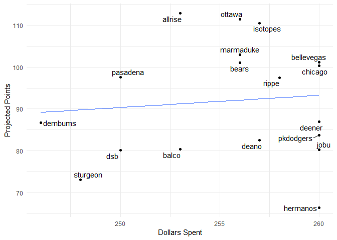

Fantasy 2019
================

#### Today's auction

| Name               |  marginal.total.points|  dollar.value|
|:-------------------|----------------------:|-------------:|
| Caleb Ferguson     |                   0.29|          0.81|
| Jorge Soler        |                   4.77|         13.13|
| Francisco Cervelli |                   4.05|         11.14|
| Chris Iannetta     |                   2.08|          5.72|
| Josh Bell          |                   5.61|         15.43|
| Dellin Betances    |                   4.05|         11.14|
| Omar Narvaez       |                   2.59|          7.13|
| Jeremy Jeffress    |                   0.88|          2.42|

#### Draft Status

| position     |  remaining|   max|   avg|
|:-------------|----------:|-----:|-----:|
| catcher      |         14|  11.1|   5.0|
| dh           |          4|  12.6|   6.2|
| first\_base  |          8|  16.1|  10.2|
| outfield     |         40|  16.4|   7.8|
| second\_base |          6|  10.6|   5.6|
| shortstop    |          7|  11.7|   7.4|
| third\_base  |          9|  14.0|   7.2|
| pitcher      |         79|  15.0|   4.9|

| Position |  Still\_to\_be\_Drafted|
|:---------|-----------------------:|
| 1B       |                       2|
| 2B       |                       4|
| 3B       |                       1|
| CI       |                       6|
| DH       |                      13|
| MI       |                       4|
| SS       |                       1|
| C        |                      12|
| OF       |                      23|
| P        |                      54|
| Total    |                     120|

#### Current Standings

| team\_name |  spent|  left|  picks.left|  max\_bid|  total\_points|  hit.points|  pitch.points|
|:-----------|------:|-----:|-----------:|---------:|--------------:|-----------:|-------------:|
| ottawa     |    237|    23|           7|        17|          101.5|        50.4|          51.1|
| allrise    |    232|    28|          10|        19|          100.9|        46.8|          54.1|
| bellevegas |    253|     7|           2|         6|          100.7|        50.8|          49.9|
| isotopes   |    237|    23|           7|        17|           97.3|        55.3|          42.0|
| marmaduke  |    247|    13|           7|         7|           95.6|        43.8|          51.8|
| rippe      |    227|    33|           9|        25|           92.4|        31.4|          61.0|
| pkdodgers  |    256|     4|           2|         3|           90.4|        35.7|          54.7|
| pasadena   |    231|    29|          10|        20|           88.8|        56.7|          32.1|
| chicago    |    225|    35|           4|        32|           86.1|        48.7|          37.4|
| deener     |    258|     2|           2|         1|           84.5|        23.5|          61.0|
| dsb        |    242|    18|           8|        11|           83.8|        35.7|          48.1|
| bears      |    226|    34|           8|        27|           81.2|        40.0|          41.2|
| dembums    |    229|    31|          12|        20|           79.5|        36.7|          42.8|
| jobu       |    252|     8|           4|         5|           77.0|        31.9|          45.1|
| sturgeon   |    225|    35|           9|        27|           76.5|        51.0|          25.5|
| balco      |    231|    29|           6|        24|           73.1|        40.2|          32.9|
| deano      |    245|    15|           9|         7|           71.6|        24.0|          47.6|
| hermanos   |    250|    10|           4|         7|           64.9|        36.6|          28.3|

#### Top Remaining Pitchers

| Name               | Team      |   IP|   ERA|  WHIP|    K|   SV|    W|   pts|    dlr|
|:-------------------|:----------|----:|-----:|-----:|----:|----:|----:|-----:|------:|
| Collin McHugh      | Astros    |  151|  4.07|  1.25|  153|    0|   10|  5.44|  14.99|
| Steven Matz        | Mets      |  162|  4.03|  1.29|  153|    0|    9|  4.78|  13.17|
| Danny Duffy        | Royals    |  185|  4.31|  1.33|  164|    0|   10|  4.43|  12.20|
| Mike Minor         | Rangers   |  175|  4.49|  1.30|  160|    0|   10|  4.29|  11.82|
| Marcus Stroman     | Blue Jays |  177|  4.06|  1.36|  138|    0|   11|  4.11|  11.30|
| Dellin Betances    | Yankees   |   75|  2.84|  1.12|  116|    3|    4|  4.05|  11.14|
| Caleb Smith        | Marlins   |  141|  3.99|  1.28|  145|    0|    7|  3.90|  10.74|
| Vince Velasquez    | Phillies  |  150|  4.36|  1.33|  158|    0|    9|  3.89|  10.70|
| Jeff Samardzija    | Giants    |  165|  4.34|  1.29|  134|    0|    9|  3.50|   9.65|
| Anthony DeSclafani | Reds      |  153|  4.44|  1.30|  142|    0|    9|  3.49|   9.61|
| Jake Odorizzi      | Twins     |  161|  4.59|  1.34|  151|    0|    9|  3.03|   8.35|
| Trevor Richards    | Marlins   |  132|  4.05|  1.29|  123|    0|    7|  2.92|   8.04|
| Tyler Anderson     | Rockies   |  155|  4.50|  1.35|  144|    0|    9|  2.91|   8.00|
| Wei-Yin Chen       | Marlins   |  157|  4.32|  1.31|  130|    0|    8|  2.84|   7.82|
| Mike Fiers         | Athletics |  152|  4.51|  1.31|  129|    0|    9|  2.81|   7.74|

#### Top Remaining Hitters

| Name             | Team         |   PA|    R|   HR|  RBI|   SB|    AVG|   pts|    dlr|
|:-----------------|:-------------|----:|----:|----:|----:|----:|------:|-----:|------:|
| Kevin Pillar     | Blue Jays    |  609|   68|   15|   65|   14|  0.258|  5.98|  16.45|
| Brandon Belt     | Giants       |  630|   79|   21|   79|    4|  0.259|  5.85|  16.11|
| Mark Trumbo      | Orioles      |  595|   69|   28|   80|    1|  0.246|  5.65|  15.57|
| Wilmer Flores    | Diamondbacks |  604|   69|   22|   80|    2|  0.275|  5.63|  15.50|
| Josh Bell        | Pirates      |  616|   74|   20|   76|    4|  0.268|  5.61|  15.43|
| Steven Souza Jr. | Diamondbacks |  560|   66|   21|   67|   11|  0.239|  5.38|  14.82|
| Leonys Martin    | Indians      |  525|   64|   15|   55|   16|  0.249|  5.30|  14.59|
| Evan Longoria    | Giants       |  630|   68|   21|   78|    4|  0.256|  5.07|  13.96|
| Jorge Soler      | Royals       |  581|   68|   23|   70|    4|  0.242|  4.77|  13.13|
| Scott Schebler   | Reds         |  520|   63|   22|   69|    5|  0.244|  4.65|  12.80|
| Adam Frazier     | Pirates      |  568|   68|   10|   55|   10|  0.274|  4.61|  12.70|
| Ryan O'Hearn     | Royals       |  616|   68|   23|   76|    2|  0.234|  4.58|  12.60|
| Greg Allen       | Indians      |  490|   56|    6|   42|   25|  0.250|  4.51|  12.41|
| Tyler Naquin     | Indians      |  560|   65|   14|   65|    6|  0.261|  4.42|  12.16|
| Zack Cozart      | Angels       |  630|   78|   19|   69|    3|  0.248|  4.26|  11.72|

#### Dollars vs. projected points

#### Remaining Picks vs. projected points

#### Best Draft Picks

| team       | player           |  salary|  dollar\_value|  equity|
|:-----------|:-----------------|-------:|--------------:|-------:|
| balco      | Jose Alvarado    |       5|          15.73|   10.73|
| sturgeon   | Brad Peacock     |       5|          15.57|   10.57|
| ottawa     | Hernan Perez     |       5|          14.86|    9.86|
| deener     | Ryan McMahon     |       4|          13.50|    9.50|
| bellevegas | Asdrubal Cabrera |       5|          14.08|    9.08|
| pasadena   | Kendrys Morales  |       8|          17.05|    9.05|
| isotopes   | Kole Calhoun     |       6|          14.94|    8.94|
| balco      | Kevin Kiermaier  |       9|          17.62|    8.62|
| pkdodgers  | Rich Hill        |      15|          23.02|    8.02|
| marmaduke  | Marco Gonzales   |       8|          15.92|    7.92|
| rippe      | Sonny Gray       |       4|          11.79|    7.79|
| deener     | Marcus Semien    |       9|          16.45|    7.45|
| chicago    | Miguel Sano      |      11|          18.32|    7.32|
| bellevegas | Domingo Santana  |       9|          16.27|    7.27|
| chicago    | Ryan Braun       |      15|          22.26|    7.26|
| ottawa     | Justin Smoak     |      10|          16.97|    6.97|
| bellevegas | Kyle Gibson      |       8|          14.95|    6.95|
| bellevegas | Delino DeShields |       5|          11.70|    6.70|
| marmaduke  | Miguel Cabrera   |      13|          19.36|    6.36|
| pasadena   | Joe Musgrove     |       8|          14.35|    6.35|

#### Unmatched Draft Picks

    ## # A tibble: 14 x 3
    ##    player                team      error      
    ##    <chr>                 <chr>     <chr>      
    ##  1 Luis Robert           allrise   not matched
    ##  2 Royce Lewis           bears     not matched
    ##  3 Brendan McKay         chicago   not matched
    ##  4 Keston Hiura          chicago   not matched
    ##  5 Taylor Trammell       deano     not matched
    ##  6 Forest Whitley        dembums   not matched
    ##  7 Sixto Sanchez         hermanos  not matched
    ##  8 Vladimir Guerrero Jr. ottawa    not matched
    ##  9 Austin Riley          pasadena  not matched
    ## 10 Yusei Kikuchi         rippe     not matched
    ## 11 Nick Senzel           marmaduke not matched
    ## 12 Michael Kopech        deano     not matched
    ## 13 Kyler Murray          bears     not matched
    ## 14 Peter Alonso          sturgeon  not matched
