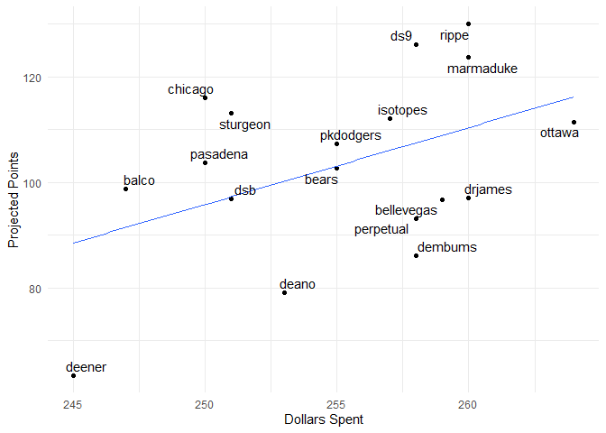

Fantasy 2019
================

\#\#\#\#Today’s auction

| Name              | marginal.total.points | dollar.value |
| :---------------- | --------------------: | -----------: |
| Edwin Encarnacion |                  8.45 |        23.27 |
| Justin Turner     |                  8.43 |        23.21 |
| Will Smith        |                    NA |           NA |
| Omar Narvaez      |                  3.32 |         9.13 |
| Kyle Hendricks    |                  4.59 |        12.65 |
| Kwang-Hyun Kim    |                    NA |           NA |
| Nelson Cruz       |                 12.67 |        34.88 |
| Adam Eaton        |                  8.12 |        22.34 |

\#\#\#\#Draft Status

| position     | remaining |  max |  avg |
| :----------- | --------: | ---: | ---: |
| catcher      |        24 | 12.0 |  5.6 |
| dh           |         5 | 34.9 | 18.4 |
| first\_base  |        12 | 19.9 |  9.6 |
| outfield     |        61 | 25.6 | 11.3 |
| second\_base |        11 | 18.0 |  9.3 |
| shortstop    |        10 | 16.1 |  9.2 |
| third\_base  |        15 | 23.2 | 10.6 |
| pitcher      |        96 | 16.2 |  6.0 |

| Position | Still\_to\_be\_Drafted |
| :------- | ---------------------: |
| 1B       |                      5 |
| 2B       |                      5 |
| 3B       |                      3 |
| CI       |                     12 |
| DH       |                     14 |
| MI       |                      6 |
| SS       |                      0 |
| C        |                     19 |
| OF       |                     42 |
| P        |                     91 |
| Total    |                    197 |

\#\#\#\#Current
Standings

| team\_name | spent | left | picks.left | max\_bid | total\_points | hit.points | pitch.points |
| :--------- | ----: | ---: | ---------: | -------: | ------------: | ---------: | -----------: |
| marmaduke  |   199 |   61 |          9 |       53 |          99.6 |       55.4 |         44.2 |
| dsb        |   248 |   12 |          9 |        4 |          96.7 |       39.2 |         57.5 |
| sturgeon   |   202 |   58 |         12 |       47 |          94.0 |       58.5 |         35.5 |
| ottawa     |   190 |   70 |         13 |       58 |          89.3 |       44.0 |         45.3 |
| rippe      |   172 |   88 |         13 |       76 |          87.2 |       33.9 |         53.3 |
| chicago    |   195 |   65 |          9 |       57 |          86.1 |       48.6 |         37.5 |
| pasadena   |   205 |   55 |         11 |       45 |          85.9 |       46.6 |         39.3 |
| isotopes   |   199 |   61 |         12 |       50 |          84.6 |       40.1 |         44.5 |
| ds9        |   185 |   75 |         13 |       63 |          81.3 |       23.5 |         57.8 |
| bellevegas |   213 |   47 |          7 |       41 |          80.5 |       40.0 |         40.5 |
| dembums    |   231 |   29 |         10 |       20 |          78.6 |       32.2 |         46.4 |
| deano      |   236 |   24 |         11 |       14 |          77.7 |       56.0 |         21.7 |
| pkdodgers  |   174 |   86 |          9 |       78 |          76.1 |       33.1 |         43.0 |
| bears      |   215 |   45 |         11 |       35 |          75.3 |       33.9 |         41.4 |
| balco      |   180 |   80 |         11 |       70 |          75.2 |       43.9 |         31.3 |
| drjames    |   211 |   49 |         11 |       39 |          65.9 |       30.2 |         35.7 |
| perpetual  |   177 |   83 |         13 |       71 |          48.9 |       24.9 |         24.0 |
| deener     |   140 |  120 |         13 |      108 |          33.8 |       12.5 |         21.3 |

\#\#\#\#Top Remaining
Pitchers

| Name             | Team      |  IP |  ERA | WHIP |   K | SV |  W |  pts |   dlr |
| :--------------- | :-------- | --: | ---: | ---: | --: | -: | -: | ---: | ----: |
| Chris Archer     | Pirates   | 180 | 4.18 | 1.29 | 196 |  0 | 11 | 5.89 | 16.21 |
| Keone Kela       | Pirates   |  65 | 3.63 | 1.22 |  81 | 27 |  3 | 5.84 | 16.07 |
| Ian Kennedy      | Royals    |  65 | 4.34 | 1.25 |  67 | 31 |  3 | 5.49 | 15.13 |
| Joe Jimenez      | Tigers    |  65 | 4.19 | 1.27 |  76 | 29 |  3 | 5.38 | 14.81 |
| Jon Gray         | Rockies   | 186 | 4.32 | 1.32 | 190 |  0 | 12 | 5.31 | 14.61 |
| Garrett Richards | Padres    | 165 | 3.89 | 1.33 | 171 |  0 | 11 | 5.24 | 14.43 |
| Miles Mikolas    | Cardinals | 195 | 4.21 | 1.26 | 155 |  0 | 11 | 5.13 | 14.11 |
| Dylan Bundy      | Angels    | 178 | 4.47 | 1.26 | 177 |  0 | 11 | 5.12 | 14.08 |
| Tony Watson      | Giants    |  68 | 3.86 | 1.26 |  63 | 27 |  3 | 4.96 | 13.66 |
| Kevin Gausman    | Giants    | 164 | 4.04 | 1.26 | 155 |  0 |  9 | 4.70 | 12.93 |
| Mark Melancon    | Braves    |  65 | 3.72 | 1.29 |  61 | 26 |  3 | 4.65 | 12.80 |
| Kyle Hendricks   | Cubs      | 179 | 4.31 | 1.27 | 151 |  0 | 11 | 4.59 | 12.65 |
| Joe Musgrove     | Pirates   | 179 | 4.26 | 1.28 | 163 |  0 | 10 | 4.58 | 12.60 |
| Nathan Eovaldi   | Red Sox   | 160 | 4.23 | 1.30 | 153 |  0 | 11 | 4.41 | 12.15 |
| Jose Urena       | Marlins   |  74 | 4.14 | 1.30 |  64 | 26 |  3 | 4.36 | 12.00 |

\#\#\#\#Top Remaining
Hitters

| Name               | Team         |  PA |  R | HR | RBI | SB |   AVG |   pts |   dlr |
| :----------------- | :----------- | --: | -: | -: | --: | -: | ----: | ----: | ----: |
| Nelson Cruz        | Twins        | 637 | 95 | 40 | 112 |  1 | 0.282 | 12.67 | 34.88 |
| Yasiel Puig        | NA           | 560 | 70 | 25 |  81 | 14 | 0.268 |  9.30 | 25.61 |
| Edwin Encarnacion  | White Sox    | 581 | 81 | 35 |  93 |  2 | 0.246 |  8.45 | 23.27 |
| Justin Turner      | Dodgers      | 609 | 86 | 26 |  84 |  3 | 0.280 |  8.43 | 23.21 |
| Michael Conforto   | Mets         | 602 | 82 | 31 |  85 |  5 | 0.251 |  8.34 | 22.97 |
| Adam Eaton         | Nationals    | 630 | 86 | 15 |  63 | 12 | 0.282 |  8.12 | 22.34 |
| Justin Upton       | Angels       | 623 | 81 | 30 |  91 |  5 | 0.240 |  7.87 | 21.65 |
| Andrew McCutchen   | Phillies     | 567 | 80 | 26 |  71 |  8 | 0.258 |  7.73 | 21.29 |
| Nick Solak         | Rangers      | 616 | 77 | 23 |  77 |  8 | 0.268 |  7.45 | 20.52 |
| David Peralta      | Diamondbacks | 595 | 76 | 21 |  76 |  3 | 0.279 |  7.34 | 20.22 |
| Jackie Bradley Jr. | Red Sox      | 637 | 80 | 22 |  79 | 12 | 0.240 |  7.34 | 20.20 |
| Shin-Soo Choo      | Rangers      | 630 | 87 | 22 |  66 |  9 | 0.255 |  7.26 | 19.99 |
| Randal Grichuk     | Blue Jays    | 560 | 73 | 31 |  86 |  3 | 0.245 |  7.26 | 19.98 |
| Joey Votto         | Reds         | 651 | 88 | 22 |  74 |  4 | 0.269 |  7.23 | 19.90 |
| Daniel Murphy      | Rockies      | 560 | 71 | 21 |  79 |  2 | 0.288 |  7.21 | 19.86 |
| \#\#\#\#Top OF     |              |     |    |    |     |    |       |       |       |

| Name               | Team         |  PA |  R | HR | RBI | SB |   AVG |  pts |   dlr |
| :----------------- | :----------- | --: | -: | -: | --: | -: | ----: | ---: | ----: |
| Yasiel Puig        | NA           | 560 | 70 | 25 |  81 | 14 | 0.268 | 9.30 | 25.61 |
| Michael Conforto   | Mets         | 602 | 82 | 31 |  85 |  5 | 0.251 | 8.34 | 22.97 |
| Adam Eaton         | Nationals    | 630 | 86 | 15 |  63 | 12 | 0.282 | 8.12 | 22.34 |
| Justin Upton       | Angels       | 623 | 81 | 30 |  91 |  5 | 0.240 | 7.87 | 21.65 |
| Andrew McCutchen   | Phillies     | 567 | 80 | 26 |  71 |  8 | 0.258 | 7.73 | 21.29 |
| David Peralta      | Diamondbacks | 595 | 76 | 21 |  76 |  3 | 0.279 | 7.34 | 20.22 |
| Jackie Bradley Jr. | Red Sox      | 637 | 80 | 22 |  79 | 12 | 0.240 | 7.34 | 20.20 |
| Shin-Soo Choo      | Rangers      | 630 | 87 | 22 |  66 |  9 | 0.255 | 7.26 | 19.99 |
| Randal Grichuk     | Blue Jays    | 560 | 73 | 31 |  86 |  3 | 0.245 | 7.26 | 19.98 |
| Anthony Santander  | Orioles      | 588 | 69 | 24 |  79 |  5 | 0.262 | 7.01 | 19.31 |
| Hunter Renfroe     | Rays         | 574 | 70 | 31 |  84 |  4 | 0.231 | 6.41 | 17.65 |
| Nick Markakis      | Braves       | 616 | 71 | 15 |  76 |  2 | 0.284 | 6.34 | 17.47 |
| Gregory Polanco    | Pirates      | 560 | 68 | 22 |  71 |  9 | 0.249 | 6.27 | 17.26 |
| Steven Souza Jr.   | NA           | 539 | 68 | 24 |  71 |  9 | 0.243 | 6.22 | 17.12 |
| Kevin Kiermaier    | Rays         | 574 | 65 | 17 |  64 | 18 | 0.239 | 6.15 | 16.93 |

<!-- -->

\#\#\#\#Remaining Picks vs. projected points
<!-- -->

\#\#\#\#Best Draft Picks

| team       | player            | salary | dollar\_value | equity |
| :--------- | :---------------- | -----: | ------------: | -----: |
| chicago    | Jason Heyward     |      7 |         17.47 |  10.47 |
| marmaduke  | Travis Shaw       |      6 |         15.28 |   9.28 |
| chicago    | Jean Segura       |     13 |         22.26 |   9.26 |
| isotopes   | Khris Davis       |     17 |         26.16 |   9.16 |
| chicago    | Lorenzo Cain      |     16 |         24.32 |   8.32 |
| pkdodgers  | Jesse Winker      |      6 |         14.14 |   8.14 |
| pkdodgers  | Andrelton Simmons |     10 |         18.07 |   8.07 |
| deano      | Buster Posey      |      8 |         15.56 |   7.56 |
| pkdodgers  | Jorge Polanco     |     15 |         22.15 |   7.15 |
| ottawa     | Dee Gordon        |      5 |         11.64 |   6.64 |
| marmaduke  | Yadier Molina     |      8 |         14.30 |   6.30 |
| dsb        | Ryan Braun        |     17 |         23.07 |   6.07 |
| bellevegas | Michael Brantley  |     19 |         24.63 |   5.63 |
| marmaduke  | Carlos Santana    |     19 |         24.61 |   5.61 |
| perpetual  | Marcell Ozuna     |     26 |         31.50 |   5.50 |
| pasadena   | Andrew Heaney     |     16 |         20.95 |   4.95 |
| dsb        | Chris Sale        |     33 |         37.59 |   4.59 |
| bears      | Paul Goldschmidt  |     24 |         28.53 |   4.53 |
| marmaduke  | Giancarlo Stanton |     34 |         38.52 |   4.52 |
| drjames    | Edwin Diaz        |     20 |         24.42 |   4.42 |

\#\#\#\#Unmatched Draft Picks

| player            | team       | error       |
| :---------------- | :--------- | :---------- |
| Nick Madrigal     | bears      | not matched |
| Alec Bohm         | bears      | not matched |
| Adley Rutschman   | bears      | not matched |
| Royce Lewis       | bears      | not matched |
| Jarred Kelenic    | chicago    | not matched |
| Joey Bart         | deener     | not matched |
| Seth Beer         | deener     | not matched |
| Jonathan India    | deener     | not matched |
| Kristian Robinson | ds9        | not matched |
| Matt Manning      | dembums    | not matched |
| Vidal Brujan      | deano      | not matched |
| Triston Casas     | deano      | not matched |
| Nolan Gorman      | drjames    | not matched |
| Luis Patino       | isotopes   | not matched |
| Marco Luciano     | ottawa     | not matched |
| Casey Mize        | pasadena   | not matched |
| Nate Lowe         | perpetual  | not matched |
| Ian Anderson      | perpetual  | not matched |
| Nate Pearson      | perpetual  | not matched |
| Gio Urshela       | pkdodgers  | not matched |
| Keibert Ruiz      | pkdodgers  | not matched |
| Wander Franco     | rippe      | not matched |
| Xavier Edwards    | sturgeon   | not matched |
| Andrew Vaughn     | marmaduke  | not matched |
| Ryon Healy        | bellevegas | not matched |
