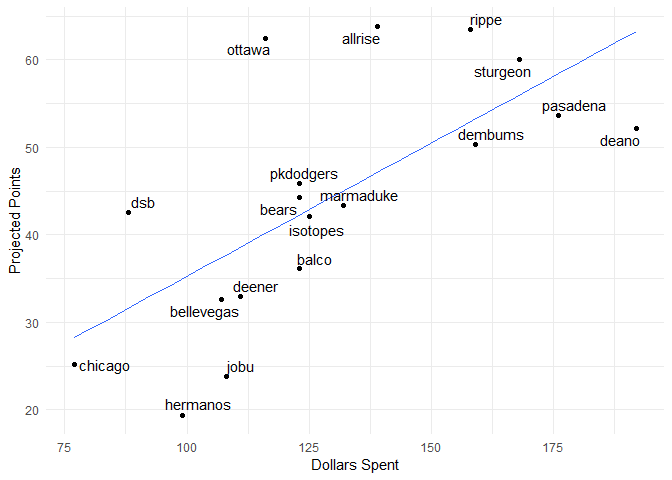

Fantasy 2018
================

#### Current Standings

    ##     team_name spent left picks.left total_points hit.points pitch.points
    ## 1       rippe   259    1          0        115.8       71.4         44.4
    ## 2       bears   259    1          0        113.9       68.3         45.6
    ## 3   marmaduke   260    0          0        112.5       70.8         41.7
    ## 4    isotopes   253    7          0        110.5       63.9         46.6
    ## 5      ottawa   262   -2          0        107.7       60.6         47.1
    ## 6    pasadena   259    1          0        104.9       67.0         37.9
    ## 7     dembums   255    5          0        101.1       61.5         39.6
    ## 8       deano   260    0          0         98.4       48.5         49.9
    ## 9        jobu   260    0          0         98.2       42.3         55.9
    ## 10        dsb   260    0          0         98.2       58.2         40.0
    ## 11      balco   253    7          0         96.9       55.3         41.6
    ## 12  bookhouse   260    0          0         95.7       48.4         47.3
    ## 13 bellevegas   258    2          0         91.1       49.5         41.6
    ## 14       vero   251    9          0         90.2       46.1         44.1
    ## 15     deener   236   24          0         89.5       52.9         36.6
    ## 16  pkdodgers   260    0          0         87.3       45.8         41.5
    ## 17   sturgeon   244   16          0         86.3       34.7         51.6
    ## 18   hermanos   258    2          0         84.0       42.5         41.5

#### Top Remaining Pitchers

    ##                name      Team  IP  ERA WHIP   K SV  W  pts  dlr
    ## 1      Nick Pivetta  Phillies 159 4.60 1.35 160  0 10 2.22 6.12
    ## 2       Juan Minaya White Sox  65 4.52 1.40  64 20  3 2.12 5.83
    ## 3     Matt Andriese      Rays 133 4.12 1.28 119  0  8 1.98 5.44
    ## 4    Tyler Anderson   Rockies 142 4.30 1.35 128  0  9 1.68 4.63
    ## 5     Jharel Cotton Athletics 157 4.77 1.35 143  0  9 1.40 3.86
    ## 6  Brandon Woodruff   Brewers 141 4.48 1.36 126  0  9 1.37 3.76
    ## 7    Nathan Eovaldi      Rays 132 4.09 1.34 110  0  8 1.35 3.72
    ## 8    Chris Stratton    Giants 157 4.25 1.41 127  0  9 1.14 3.13
    ## 9  Brandon McCarthy    Braves 158 4.59 1.39 136  0  9 1.10 3.02
    ## 10 Santiago Casilla Athletics  65 4.40 1.35  61 13  3 1.08 2.97
    ## 11   Erasmo Ramirez  Mariners 129 4.47 1.32 102  0  8 0.96 2.63
    ## 12      Kyle Gibson     Twins 165 4.50 1.44 123  0 11 0.93 2.57
    ## 13      Brett Cecil Cardinals  65 3.62 1.25  68  6  3 0.77 2.12
    ## 14  Anthony Swarzak      Mets  65 3.50 1.20  71  4  3 0.73 2.01
    ## 15    Brock Stewart   Dodgers 104 4.22 1.31 100  0  6 0.69 1.90
    ## 16   Jhoulys Chacin   Brewers 129 4.42 1.39 109  0  8 0.62 1.72
    ## 17     Darren O'Day   Orioles  65 3.76 1.23  75  4  3 0.57 1.58
    ## 18       Phil Maton    Padres  65 3.83 1.25  75  4  3 0.46 1.27
    ## 19     Jaime Garcia Blue Jays 120 4.37 1.36  98  0  7 0.43 1.19
    ## 20     Zack Wheeler      Mets 123 4.44 1.40 115  0  7 0.43 1.18

#### Top Remaining Hitters

    ##                name      Team  PA  R HR RBI SB   AVG  pts   dlr
    ## 1         Joe Panik    Giants 592 72 11  59  4 0.283 4.12 11.35
    ## 2       Neil Walker      <NA> 527 66 20  69  2 0.267 4.05 11.14
    ## 3        Matt Duffy      Rays 526 56 11  55 10 0.264 3.48  9.58
    ## 4     Jose Iglesias    Tigers 541 57  6  50 10 0.271 3.07  8.44
    ## 5  Cheslor Cuthbert    Royals 537 57 15  59  3 0.257 2.79  7.68
    ## 6      Martin Prado   Marlins 528 54  9  53  2 0.274 2.69  7.40
    ## 7        Jed Lowrie Athletics 587 66 11  60  1 0.263 2.58  7.11
    ## 8    Dansby Swanson    Braves 551 58 10  58  5 0.258 2.57  7.08
    ## 9      Jordy Mercer   Pirates 563 56 12  60  2 0.259 2.34  6.44
    ## 10  Victor Martinez    Tigers 560 60 17  70  0 0.270 2.27  6.26
    ## 11       Seth Smith      <NA> 438 56 15  50  2 0.255 1.66  4.56
    ## 12     Steve Pearce Blue Jays 396 49 16  52  1 0.258 1.64  4.52
    ## 13    Chase Headley    Padres 502 51 10  49  5 0.250 1.61  4.43
    ## 14    Paulo Orlando    Royals 492 48  8  44 10 0.258 1.59  4.38
    ## 15   Derek Dietrich   Marlins 447 52 13  50  1 0.249 1.48  4.08
    ## 16  Alcides Escobar    Royals 516 50  5  42 10 0.256 1.46  4.02
    ## 17    Dixon Machado    Tigers 498 51  6  42  8 0.255 1.44  3.98
    ## 18       Matt Joyce Athletics 453 60 16  53  3 0.237 1.33  3.65
    ## 19   Yolmer Sanchez White Sox 463 48 10  48  8 0.249 1.24  3.42
    ## 20    Leonys Martin    Tigers 358 41  8  36 16 0.248 1.17  3.22

#### Top Remaining OF

    ##                 name      Team  PA  R HR RBI SB   AVG   pts   dlr
    ## 1         Seth Smith      <NA> 438 56 15  50  2 0.255  1.66  4.56
    ## 2       Steve Pearce Blue Jays 396 49 16  52  1 0.258  1.64  4.52
    ## 3      Paulo Orlando    Royals 492 48  8  44 10 0.258  1.59  4.38
    ## 4         Matt Joyce Athletics 453 60 16  53  3 0.237  1.33  3.65
    ## 5      Leonys Martin    Tigers 358 41  8  36 16 0.248  1.17  3.22
    ## 6     Austin Jackson    Giants 413 43  6  40  7 0.266  1.07  2.93
    ## 7      Hunter Dozier    Royals 544 57 15  57  5 0.221  0.67  1.84
    ## 8      Matt Holliday      <NA> 394 45 15  53  1 0.243  0.64  1.76
    ## 9            Jon Jay      <NA> 414 46  4  34  5 0.267  0.60  1.67
    ## 10     Mike Tauchman   Rockies 265 29  4  27  8 0.278  0.56  1.55
    ## 11        Adam Engel White Sox 494 52 10  42 20 0.204  0.34  0.94
    ## 12  Magneuris Sierra   Marlins 410 37  3  33 14 0.247  0.23  0.63
    ## 13   Robbie Grossman     Twins 337 42  8  36  3 0.257  0.14  0.40
    ## 14      Joey Rickard   Orioles 374 41  6  32  8 0.249  0.03  0.10
    ## 15        Ben Revere      <NA> 205 22  1  17 11 0.280 -0.05 -0.13
    ## 16    Howie Kendrick Nationals 204 23  4  22  4 0.286 -0.06 -0.16
    ## 17 Enrique Hernandez   Dodgers 373 43 11  42  4 0.236 -0.22 -0.60
    ## 18        Lane Adams    Braves 259 29  7  27 14 0.232 -0.95 -2.61
    ## 19       Braxton Lee   Marlins 358 32  2  26 10 0.243 -1.04 -2.87
    ## 20      Zack Granite     Twins 175 19  1  15  9 0.270 -1.05 -2.88

#### Dollars vs. projected points

    ## # A tibble: 18 x 4
    ##    rowname    total_points value   delta
    ##    <chr>             <dbl> <dbl>   <dbl>
    ##  1 rippe             116   101    14.9  
    ##  2 isotopes          110    97.2  13.3  
    ##  3 bears             114   101    13.0  
    ##  4 marmaduke         112   101    11.0  
    ##  5 ottawa            108   103     5.00 
    ##  6 pasadena          105   101     4.03 
    ##  7 dembums           101    98.4   2.66 
    ##  8 deener             89.5  86.8   2.65 
    ##  9 balco              96.9  97.2 - 0.315
    ## 10 deano              98.4 101   - 3.08 
    ## 11 jobu               98.2 101   - 3.28 
    ## 12 dsb                98.2 101   - 3.28 
    ## 13 sturgeon           86.3  91.7 - 5.43 
    ## 14 bookhouse          95.7 101   - 5.78 
    ## 15 vero               90.2  96.0 - 5.80 
    ## 16 bellevegas         91.1 100   - 9.16 
    ## 17 pkdodgers          87.3 101   -14.2  
    ## 18 hermanos           84.0 100   -16.3

#### Remaining Picks vs. projected points

#### Data entry errors

    ##                   player      team       error
    ## 1        Brendan Rodgers     rippe not matched
    ## 2            Nick Senzel  sturgeon not matched
    ## 3            Alec Hansen pkdodgers not matched
    ## 4  Vladimir Guerrero Jr.    ottawa not matched
    ## 5           Kolby Allard      jobu not matched
    ## 6           Kevin Maitan     deano not matched
    ## 7               A.J. Puk    ottawa not matched
    ## 8          Scott Kingery  sturgeon not matched
    ## 9           Mitch Keller pkdodgers not matched
    ## 10    Fernando Tatis Jr.    ottawa not matched
    ## 11      Yoshihisa Hirano  hermanos not matched
    ## 12          Darren O’Day       dsb not matched
    ## 13           Bo Bichette  sturgeon not matched
    ## 14         Brenden McKay     rippe not matched
    ## 15           Luis Robert  pasadena not matched
    ## 16        MacKenzie Gore     rippe not matched
    ## 17             Juan soto  isotopes not matched
    ## 18        Sixto Sanchez  bookhouse not matched
    ## 19          Keston Hiura bookhouse not matched
    ## 20           Royce Lewis marmaduke not matched
    ## 21         Jesus Sanchez     balco not matched
    ## 22       Estevan Florial   dembums not matched
    ## 23           Mike Soroka  hermanos not matched
    ## 24          Heliot Ramos  isotopes not matched
    ## 25  Julio Pablo Martinez     rippe not matched
